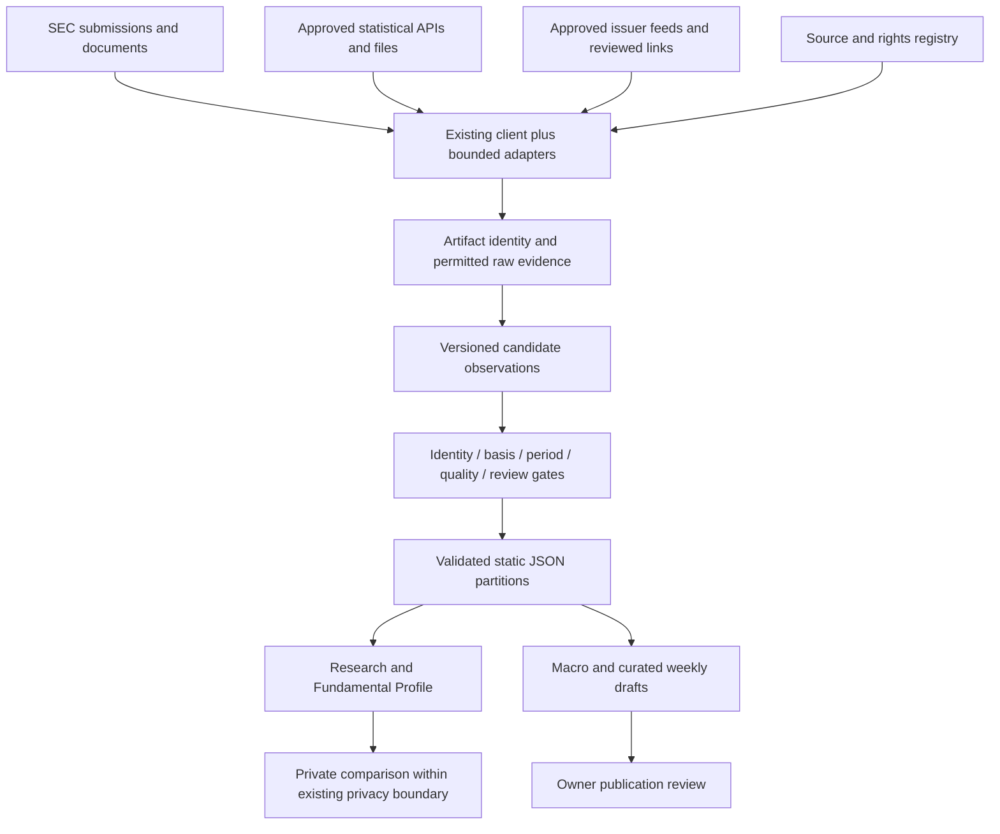

# NTM: zero-cost primary-data discovery audit

**Research/access date: 22 September 2026. Budget: 0 SEK/month in external recurring data fees. Status: discovery only; no integration approved or implemented.**

## 1. Executive decision

NTM can become a substantially stronger primary-evidence research product before buying a data subscription: reported financial history, filing/event timelines, earnings-document discovery, reviewed guidance and operating KPIs, selected ownership disclosures, and useful Swedish/US macro context. The limiting factors are reproducible interpretation, comparable definitions, rights and maintenance—not simply access to numbers.

**Recommended first implementation: a small SEC filing-event and earnings-document evidence pilot for NVDA, SOFI and CRWD.** Extend the existing submissions client; preserve accession/document identity; classify a bounded set of 8-K items; link earnings exhibits; show new evidence since a saved Research revision. Do not start by extracting every earnings table or building IR scrapers. All ten sampled companies had a current earnings 8-K and an accessible release exhibit during this audit.

Only three implementation candidates are recommended, in sequence:

1. SEC filing events and earnings-document evidence.
2. Reviewed guidance and issuer-KPI observations using those documents.
3. A small Swedish inflation/rates context pilot using SCB and Riksbanken.

**No suitable zero-cost EOD foundation found.** This is the conclusion of the bounded provider/exchange review below, not proof that no possible agreement exists anywhere. Keep EOD paused. Portfolio performance, leaderboards and historical returns still require a dependable licensed price/corporate-action foundation. Manual prices remain individual valuation assumptions.

**PAID DATA REQUIRED** for a dependable broad analyst-consensus/estimate-revision/target-price service under the sources and rights established here. Issuer guidance is not analyst consensus. An analyst-coverage list is not an estimates dataset.

Especially useful discoveries beyond the obvious SEC/company-facts foundation:

- SEC earnings exhibits already contain much of the guidance, segment and KPI evidence commonly sought from IR sites. NVIDIA also furnishes CFO commentary; Coherent furnishes a presentation in the sampled filing.
- FI publishes Swedish fund holdings as ZIP/XML, with fees and benchmark information: a plausible future *dated fund overlap* product after rights and identifier validation.
- FDIC bank financials can contextualize SoFi Bank separately from the listed parent.
- Nasdaq explicitly frees certain **named event datasets**, but this is not a blanket license for its directory, fund data or prices.
- EIA electricity capacity/generation can support evidence about industry conditions around data-center investment; it cannot establish Vertiv orders or NVIDIA revenue.

## 2. Method, evidence strength and limits

**VERIFIED FACT** means repository code/data inspected, an official web document inspected, or an official interface directly retrieved. **REASONED ARCHITECTURAL CONCLUSION** means a recommendation derived from those findings. **OPEN QUESTION** means an unverified permission, coverage boundary, technical contract or owner/product choice. “RIGHTS REVIEW REQUIRED” is a blocking condition for the proposed reuse, not permission.

The audit read the four supplied request files, current repository implementation, workflow definitions and internal coverage/publication documents. Research used official regulator, issuer, agency and provider pages. Search results from unofficial aggregators were not used as authority. Direct, low-volume SEC requests reused the existing declared user agent and throttle, without running an updater. IR inspection was bounded to public pages and links; timeouts were recorded, with no bypass attempts. No API accounts were created.

Companion evidence is [SEC sample observations](sec-sample-evidence.json) and [IR interface observations](ir-interface-evidence.json). These are **audit evidence, not production source data**. They contain URLs, identities and findings, not a complete raw-document archive. Report conclusions take precedence over unfiltered discovery hints in a page (for example, a favicon JSON manifest is not a financial-data API).

All external links in this report were accessed or surfaced in current official-source research on **2026-09-22**, unless explicitly labelled owner-supplied or unverified. A published documentation claim is not a load test. “History available” does not mean the entire archive was downloaded or its completeness validated. Exact API quotas left unknown must be checked at onboarding; no quota is inferred from a successful request.

Rights conclusions are scoped to the identified content, access channel and use. Public government sites can contain third-party material; public issuer documents are not automatically reusable presentations or transcripts. This audit establishes a conservative operating policy rather than a jurisdiction-wide legal opinion.

## 3. Actual repository architecture and overlap

| Existing layer | Inspected implementation | What already exists / implication |
|---|---|---|
| SEC transport | `scripts/sec_client.py:27`, `:134`, `:151`, `:157` | Ticker→CIK, submissions and companyfacts JSON; declared user agent, 0.15-second request spacing, bounded transient retries and Retry-After handling. Reuse it. |
| Fundamentals | `scripts/stock_normalizer.py:28`, `:583`, `:731` | Issuer/profile concept mappings, fiscal periods, annual/quarterly/TTM metrics; bank exclusions; 10-K/Q and amendments. Filing extraction filters out 8-K and ownership forms. No exhibit ingestion was found. |
| Publication contract | `scripts/stock_contract.py:7`, `scripts/update_stocks.py:30` | Versioned schema/method, exact CIK checks, evidence/period checks, degradation protection, atomic writes, unchanged-evidence detection. Extend the contract rather than replace it. |
| Coverage | `scripts/stock_contract.py:9`, `docs/research-coverage.md`, `docs/research-phase2.md` | **12** supported companies: NVDA/SOFI/CRWD/MU/MRVL/VRT/COHR/RKLB/TTMI/SNDK/FLY/CRWV. The earlier eight-company discussion is explicitly historical. |
| Fundamental Profile | `fundamental-profile.js:1` and UI | Descriptive growth, profitability, cash generation, balance/per-share evidence and quality gates; strict annual comparability; no automatic investment score. |
| Research lifecycle | `research-snapshot.js`, `thesis-storage.js`, `change-detection.js:52`, `research-review.js`, `research-continuity.js` | Saved immutable revisions and valuation/financial baselines; current fundamentals and new supported filings can already be compared. “Sedan din analys” must expand this feature, not be rebuilt as a second lifecycle. |
| Public Research | `research-publication.js`, `public-report.js`, Supabase migrations | Deliberate publication of saved analyses, with existing privacy and snapshot semantics. New data must not mutate a published historical thesis. |
| Macro | `scripts/update_macro.py:36–86`, `:528–716`; `scripts/macro_provenance.py` | BLS ICS and timeseries, FRED CSV, BEA API, Treasury Fiscal Data, DOL claims and Census economic downloads. Field provenance separates actual/previous/forecast. Failures and partial source states exist. |
| Swedish sources | `academy-catalog.js`, Knowledge source references, `data/rule-registry.json`, `data/market-calendar.js` | Swedish official educational/rule references and market-calendar information exist. **No live SCB/Riksbank statistical ingestion adapter was found** in the inspected scripts. Do not call source links an implemented data feed. |
| Weekly publication | `data/weekly-events.js`, `data/weekly-artifacts.json`, `week-pages.js`, `scripts/check_weekly_events.cjs` | Curated images, readable transcription, hashed owner review and calendar coverage states. Week-39 earnings image transcription expressly does not imply issuer verification. |
| Discord | `scripts/discord_weekly.cjs`, `.github/workflows/discord-weekly.yml` | Reviewed-artifact distribution, durable deduplication/reservation and explicit live controls. Existing foundation, not a new integration opportunity. No live state tested. |
| Static publishing | `scripts/stage_site.py`, `.github/workflows/deploy.yml` | Generated JSON/browser consumption and GitHub Pages; cloud account/publication capabilities do not require all public data ingestion to become a backend service. Internal docs are outside the staged root/data/image/vendor copy model. |

**Repository findings requiring attention in a later implementation:**

1. The deployment schedule runs at 12:35, 14:35 and 16:35 UTC on weekdays. `update_stocks.py --all` covers configured profiles, but the workflow artifact paths and `git add` explicitly carry only NVDA, SOFI and CRWD. Expanded local coverage is therefore not proof of durable scheduled refresh of all 12 names. Confirm and resolve this publication-path mismatch before promising coverage freshness. No workflow was changed.
2. Current normalizer discovery reads `filings.recent`; no traversal of the submissions historical-file list was found. Companyfacts history alone does not guarantee complete historical filing discovery.
3. `BEA_EVENT_DEFINITIONS` maps GDP to `T10101` while declaring a dollar unit. NIPA table 1.1.1 is a percent-change table; the current metadata/transform deserve a targeted review against BEA metadata. This is a **suspected mapping inconsistency**, not a claim that a currently published number has been proven wrong.
4. The three FRED series are TOTALSL, INDPRO and TCU, all originally Federal Reserve statistics. Review the current FRED access/redisplay terms and consider original-producer downloads where practical; do not silently generalize this adapter to proprietary series.

Existing US coverage includes CPI/core CPI, PPI, jobs/unemployment/earnings, productivity/unit labor costs, JOLTS, industrial production/capacity utilization/consumer credit, GDP/PCE/income/spending, Treasury monthly balance, claims, wholesale inventory and selected Census EITS indicators. New macro recommendations below concern context/history, Swedish coverage, release metadata and vintages—not another copy of those adapters.

## 4. SEC opportunity map

The official [API documentation](https://www.sec.gov/search-filings/edgar-application-programming-interfaces) confirms unauthenticated JSON, recent filing metadata plus historical files, companyfacts/companyconcept/frames and nightly bulk archives. Its aggregated XBRL facts use standard taxonomies and whole-entity contexts; **companyfacts is not a complete custom-tag/segment-dimensional API**. Frames align calendar windows and are unsuitable as a shortcut around NTM fiscal-period checks. There is no browser CORS support. Ingestion belongs outside the browser.

[SEC access guidance](https://www.sec.gov/search-filings/edgar-search-assistance/accessing-edgar-data) requires fair access and supports a maximum of 10 requests/second; use a shared lower budget across workers. [SEC reuse guidance](https://www.sec.gov/about/webmaster-frequently-asked-questions) expressly permits reuse of government-created content and EDGAR public filing content. This supports high confidence for normalized filing evidence; avoid copying unrelated copyrighted illustrations and do not assume SEC-hosted proprietary identifier lists have unrestricted database rights.

| Interface/document | Current overlap | Incremental evidence / useful product | Difficulty and limits |
|---|---|---|---|
| Submissions JSON | Already fetched; mostly 10-K/Q retained | 8-K item codes, acceptance times, amendments, other forms; Research evidence timeline | Low–medium; historical pagination and identity must be preserved; detection is not event occurrence time. |
| Companyfacts/concept | Core foundation | Selectively add SBC, interest expense, repurchase cash flows, share issuance where definitions validate | Medium; don't rebuild normalized statements or force concepts across banks/industrial companies. |
| Filing HTML/iXBRL and instance/linkbases | Filings linked; facts normalized from API | Segments, custom KPIs, debt maturities, risk/MD&A notes, accounting policies | High for generic dimension/context extraction; issuer extensions and recasts require review. |
| 8-K exhibits | Unused canonical ingestion | Earnings release, CFO commentary, presentations, material agreements | Generic discovery is feasible; generic numeric extraction is not automatically feasible. EX-99.1 alone does not mean earnings. |
| Financial Statement and Notes datasets | No ingestion found | Historical note/dimension exploration and bounded backfill | Bulk size and taxonomy semantics; use only when the product needs it. [Official dataset](https://www.sec.gov/data-research/sec-markets-data/financial-statement-notes-data-sets). |
| Form 3/4/5 XML | Unused | Neutral insider transaction evidence | Later; derivative/non-derivative tables, footnotes, amendments, joint filers and reporting delay. |
| 13F information-table XML | Unused | Dated reported manager holdings | Later; manager→security joins, confidential omissions, duplicate manager reporting and identifier licensing. |
| 13D/G and amendments | Unused | Threshold ownership events and filed statements of purpose | Later; different filing classes/deadlines; beneficial ownership is not a real-time cap table. |
| S-1/S-3/S-4, 424B, debt exhibits | Unused beyond financial context | Issuance/merger/debt evidence links | An effective shelf is capacity, not actual issuance; legal terms need interpretation. |
| N-PORT/N-CEN/prospectuses | No fund engine | Dated US fund holdings, operations and fee evidence | Later; fund/series/class IDs and publication lag; not daily ETF holdings. |

### 4.1 Filing-event semantics

Use the official [Form 8-K instructions](https://www.sec.gov/about/forms/form8-k.pdf), not keyword sentiment:

| Item | Safe label | Do not infer |
|---|---|---|
| 1.01 / 1.02 | Material agreement entered / terminated | Dollar effect or materiality magnitude from item code alone |
| 1.03 | Bankruptcy/receivership filing disclosure | Recovery value |
| 1.05 | Material cybersecurity incident disclosure | Incident first occurred on filing date; deadline normally runs from materiality determination and has exceptions |
| 2.01 | Acquisition/disposition completion disclosure | Announcement equals completion |
| 2.02 | Results/financial-condition disclosure | Every exhibit is a quarterly earnings release |
| 2.03 | Direct financial obligation/off-balance-sheet obligation | New debt automatically increases net leverage by face amount |
| 4.01 / 4.02 | Auditor change / non-reliance disclosure | Fraud or quantified restatement size |
| 5.02 / 5.07 | Officer/director changes / voting results | Every 5.02 is a CEO departure |
| 7.01 / 8.01 / 9.01 | Regulation FD / other events / exhibits | Specific business event without reading the document |

Many 8-K items use a four-business-day reporting framework, with exceptions. Store item codes as filed. Results exhibits are often **furnished**, not “filed” for Section 18 liability; preserve that distinction. A neutral “new disclosure” can auto-publish after validation; claims about the business consequence require review.

### 4.2 Insider, holdings and beneficial ownership

**Forms 3/4/5:** Form 3 establishes an initial ownership report, Form 4 usually reports changes within two business days, Form 5 covers certain annual/deferred reports. Use issuer CIK plus reporting-owner CIK, document/accession and row identity. Keep transaction date and filed/accepted time separate; preserve security title, code, price/range, amount, direct/indirect ownership, post-transaction holdings, derivative terms and footnotes. P/S are purchase/sale codes; A/M/F/G represent different grant/exercise/tax/gift circumstances. Do not classify tax withholding as an open-market sale or grants as conviction buying. Amendments must supersede/reconcile, not append duplicate trades. Sources: [Investor.gov guide](https://www.investor.gov/introduction-investing/general-resources/news-alerts/alerts-bulletins/investor-bulletins-69), [official codes](https://www.sec.gov/edgar/searchedgar/ownershipformcodes.html). **USE WHEN NEEDED**, after event infrastructure; not among the next three builds.

**13F:** Certain institutional investment managers meeting the $100m threshold report eligible Section 13(f) securities, normally within 45 days of quarter end. These are historical long-position reports; shorts are not subtracted, private/non-covered assets are omitted, confidentiality and amendments matter. Do not sum overlapping manager discretion into “all institutional ownership,” infer exact trade dates from quarter-to-quarter changes, or call holdings current. [SEC FAQ](https://www.sec.gov/rules-regulations/staff-guidance/division-investment-management-frequently-asked-questions/frequently-asked-questions-about-form-13f). A manager-specific historical view is more defensible than a complete ownership percentage.

**13D/G:** More-than-5% beneficial ownership disclosures use legal definitions and filer categories. Initial 13D generally has a five-business-day deadline; 13D material amendments generally two business days. Passive 13G and qualified/exempt filers have different timing, including quarterly and threshold-triggered requirements. Structured reporting improves parsing, not interpretation. Preserve shares, percentage denominator/date, group membership and filed purpose; never infer activist intent from a threshold alone. [Final rule](https://www.sec.gov/files/rules/final/2023/33-11253.pdf). Use a versioned rule table if deadlines ever become a feature.

### 4.3 Buybacks, dilution, debt and liquidity

Extend existing per-share evidence only where it answers a question. Distinguish repurchase authorization, actual cash spent, shares repurchased, shares issued, period-end outstanding shares and weighted-average diluted shares. Net change in shares is not gross issuance; SBC expense is not an exact share count or cash outflow. Stock splits need a common basis. Start from validated XBRL concepts; notes and repurchase tables are reviewed evidence.

Cash, debt and interest expense can be structured where issuer definitions support them. Maturity buckets, covenants, collateral, facility undrawn capacity and refinancing commentary usually require note/exhibit interpretation. Do not subtract deposits from SoFi debt as if it were an industrial company. Future “Skuld & likviditet” should show dated components and source scope; commercial credit ratings remain outside the free-data claim.

## 5. Ten-company IR audit

All companies have official earnings material and guidance evidence. None was proven to offer a documented, rights-cleared, stable issuer-KPI API. HTML tables, static documents, platform widgets and filing downloads must be distinguished. The two tables below share ticker keys and jointly cover location, report types, structure, history, timing, SEC overlap, incremental value, maintenance and rights.

### 5.1 Issuer source/metric matrix

| Issuer / official IR | Reports, formats and presentation evidence | Guidance / segment or scope / actual useful KPIs | History and material beyond companyfacts |
|---|---|---|---|
| [NVDA](https://investor.nvidia.com/financial-info/quarterly-results/default.aspx) | Release HTML, quarterly reports, PDF material, CFO commentary; RSS navigation; Q4 platform markers directly observed | Revenue point ± tolerance, GAAP/non-GAAP margins/opex; reportable segments must be separated from Data Center/Gaming market-platform disclosures | Long SEC history; IR archive depth not fully enumerated. CFO narrative/platform trends add context beyond whole-entity facts; CFO commentary is also EX-99.2 in sample, so not automatically IR-exclusive. |
| [SOFI](https://investors.sofi.com/financials/quarterly-results/default.aspx) | Earnings-release HTML/PDF and presentation PDFs; Q4 page is partly dynamic in text-only retrieval | Quarterly/annual adjusted revenue, EBITDA and earnings outlook; Lending, Financial Services, Technology Platform; members, products, cross-buy, deposits, technology-platform accounts | Public-company history since 2021; 2023/2024 documents surfaced. Member/product definitions and consolidated-vs-bank scope matter. Presentation organization and event information add convenience; much quantitative evidence is in SEC release. |
| [CRWD](https://ir.crowdstrike.com/results-filings/quarterly-results) | Release HTML, PDFs, quarterly filing, webcast, presentation and Q2 FY27 supplemental information | Revenue/non-GAAP income/EPS and ARR outlook; ARR/net-new ARR, Falcon Flex account ARR, module adoption when disclosed; subscription/services revenue is not automatically reportable segments | Archive visibly reaches FY2020; current documents through FY2027. KPI definitions and adjusted exclusions need issuer-level versions. Supplemental material adds detail; no blanket transcript permission found. |
| [MU](https://investors.micron.com/financials/quarterly-results/) | Release, presentation, **prepared remarks**, 10-Q PDFs; current Q4 markers plus older node/static-file links show migration | Quarterly revenue/EPS ranges and margin/opex outlook; current business units include Cloud Memory, Core Data Center, Mobile and Client (plus Automotive and Embedded in issuer reporting); DRAM/NAND/bit/price/capex commentary belongs to specific documents | 2026 archive directly visible; older URLs remain indexed, continuity unvalidated. Business-unit reporting differs from older CNBU/MBU/SBU/EBU organization; backfill must use recast evidence. Prepared remarks are not full Q&A transcripts. |
| [MRVL](https://investor.marvell.com/financial-information/financial-results) | HTML/PDF releases; Financial and Business Results and Additional Earnings Information PDFs; XBRL ZIP; advertised press-release RSS | Quarterly revenue/GAAP/non-GAAP EPS/margin outlook; Data Center and other end-market breakdowns are not interchangeable with reportable segments | Archive visibly reaches FY2021 and earlier entries; predecessor CIK continuity needs review. Current site has a shared template/CDN with TTMI; older InvestorRoom assets also surfaced. |
| [VRT](https://investors.vertiv.com/financials/quarterly-results/default.aspx) | Release HTML/PDF, quarterly result decks, annual documents; Q4 platform markers | Quarter/full-year sales, adjusted operating margin/EPS/FCF; regional segments; organic order growth/book-to-bill/backlog where explicitly disclosed in deck/release | 2024 deck verified, current 2026 earnings and event pages. Orders/backlog are demand evidence, not guaranteed recognized revenue. Presentation-only KPI coverage needs artifact-by-artifact comparison. |
| [COHR](https://ir.coherent.com/) | Former corporate IR URL redirects to new IR domain; release HTML/PDF, presentations, filings and webcast | Quarterly revenue/non-GAAP margin/opex/EPS; current Datacenter & Communications and Industrial segment revenue; end-market detail | Current 2026 material and legacy corporate PDFs verified; no claim of complete migrated archive. Historical II-VI/current Coherent identity and segment reorganization prohibit naive splicing. Sample SEC filing includes EX-99.2 presentation. |
| [RKLB](https://investors.rocketlabcorp.com/financial-information/quarterly-results) | Quarterly release, webcast, presentation, filing; new domain versus older rocketlabusa IR links | Quarterly revenue and GAAP/non-GAAP margin/opex/adjusted EBITDA; Launch Services/Space Systems in reports; backlog, launches and mission/contract milestones | Current archive visibly includes 2024–2026; public-company history begins earlier, complete backfill untested. Deck adds operational milestones; launches are not all equivalent in revenue or scope. |
| [TTMI](https://investors.ttm.com/financial-information/financial-results) | HTML/PDF earnings; decks; XBRL ZIP; **officially linked transcripts for selected quarters**, including Q1 2026; advertised RSS | Quarterly sales/non-GAAP EPS ranges and annual outlook; sample uses Aerospace & Defense / Commercial segments; book-to-bill, program backlog, end-market mix | Visible archive at least 2017–2026, with gaps in some quarter link sets. Useful operational evidence; transcript provider copyright still applies. Older segment labels require recast review. |
| [SNDK](https://investor.sandisk.com/) | HTML/PDF releases, static-file presentations, filings/webcasts | Quarterly revenue, GAAP/non-GAAP margin/opex/EPS; Datacenter/Edge/Consumer **end-market** revenue; don't rename these accounting segments | Current registrant CIK 2023554 has short standalone history around 2025 separation. Do not splice the former SNDK or WDC history without explicit carve-out comparability. FY25 and FY26 PDFs found. |

Evidence: the official linked archives; [CrowdStrike release](https://ir.crowdstrike.com/news-releases/news-release-details/crowdstrike-reports-second-quarter-fiscal-year-2027-financial), [Micron archive](https://investors.micron.com/financials/quarterly-results/), [TTM release](https://investors.ttm.com/news-events/press-releases/detail/411/ttm-technologies-inc-reports-second-quarter-2026-results), [Sandisk release](https://investor.sandisk.com/news-releases/news-release-details/sandisk-reports-fiscal-fourth-quarter-2026-financial-results), and the exact SEC releases in the companion evidence. These establish disclosed metric classes, not validated normalized histories.

### 5.2 Sample release/SEC identity and timing matrix

Acceptance times below are **UTC from submissions JSON**, not measured public availability or issuer publication timestamps. Each inspected 8-K identifies the earnings release as an exhibit, and each release was retrieved from SEC. Thus same-release lineage is verified at the filing-reference level; **byte-for-byte equivalence with every IR copy has not been established**. No universal IR-before-SEC latency is claimed.

| Company | Release date / SEC acceptance UTC | SEC accession (release URL in evidence file) | IR timing / added information / feasibility |
|---|---|---|---|
| NVDA | 2026-08-26 / 20:21:19 | 0001045810-26-000073 | Announced approximate release 13:20 PT, call 14:00 PT; not an observed latency measurement. SEC release + CFO commentary make SEC especially attractive. IR automated reuse restricted by linked terms. |
| SOFI | 2026-07-29 / 11:06:09 | 0001818874-26-000050 | Official schedule announced approximate 07:00 ET release and 08:00 ET call. High SEC feasibility; dynamic IR results page adds maintenance/rights work. |
| CRWD | 2026-08-26 / 20:07:02 | 0001535527-26-000029 | Same-date release; exact IR publication timestamp not independently established. Archive readable through web research, direct bounded request timed out. Medium IR discovery maintenance. |
| MU | 2026-06-24 / 20:02:01 | 0000723125-26-000013 | Same-date release, 16:30 ET call in official event listing. Prepared remarks/deck may add context. Site-platform migration increases historical link maintenance. |
| MRVL | 2026-08-27 / 20:05:59 | 0001835632-26-000022 | Official call 13:45 PT after release. RSS advertised; HTTP retrieval not established by web reader. SEC release discovery robust; adjusted/end-market extraction reviewed. |
| VRT | 2026-07-29 / 10:01:57 | 0001628280-26-050323 | Same-date release; precise public-release timestamp unverified. Common Q4 transport may help discovery, but does not standardize backlog/organic calculations. |
| COHR | 2026-08-12 / 20:10:13 | 0001193125-26-346860 | Official after-close release and 16:30 ET call; SEC presentation included. Domain migration and direct-request timeout make IR-only maintenance medium–high. |
| RKLB | 2026-08-10 / 20:08:45 | 0001819994-26-000061 | Official event 17:00 ET; release is earlier than call. Domain migration/direct timeout; operational detail requires review. |
| TTMI | 2026-08-05 / **2026-08-06** 01:28:46 | 0001193125-26-336163 | Release dated Aug 5, SEC filing date Aug 6; official call Aug 5 16:30 ET. Date/time conversion is essential; no guessed before/after-market status from filing date. |
| SNDK | 2026-08-05 / 20:09:06 | 0001628280-26-053346 | IR release header 16:05; retain source timezone verification before computing latency. Short issuer history; direct IR request timed out. |

Scheduling evidence: [NVIDIA announcement](https://nvidianews.nvidia.com/news/nvidia-sets-conference-call-for-second-quarter-financial-results-6927195), [SoFi announcement](https://investors.sofi.com/news/news-details/2026/SoFi-Schedules-Conference-Call-to-Discuss-Q2-2026-Results/default.aspx), [Marvell announcement](https://investor.marvell.com/news-events/press-releases/detail/1029/marvell-technology-inc-announces-conference-call-to-review-second-quarter-of-fiscal-year-2027-financial-results-announces-investor-day-on-october-6-2026), [Coherent event](https://ir.coherent.com/events/event-details/fourth-quarter-and-fiscal-year-end-2026-conference-call), [Rocket Lab events](https://investors.rocketlabcorp.com/events-presentations/events).

### 5.3 Common infrastructure and reuse rights

Direct page-source observations found Q4 markers on **NVDA, SOFI, MU and VRT**. MRVL and TTMI share a similar financial-results template and `d1io3yog0oux5.cloudfront.net` asset hosting, with QuoteMedia widget markers; this does not mean QuoteMedia owns their earnings-release content or that market-price widgets are reusable. CrowdStrike, Coherent, Rocket Lab and Sandisk expose similar node/static-file document patterns in the web-visible archive. Their direct requests timed out; a specific vendor/API contract was not verified. Do not label an inferred platform as a supported API.

MRVL and TTMI advertise `/news-events/press-releases/rss`. NVIDIA exposes an RSS landing page. Q4 API markers suggest shared discovery plumbing, but no documented, authorized financial JSON endpoint was validated. MU's HTML includes spreadsheet/file-format hints; these were not proven to be issuer financial XLS/CSV downloads. **No confirmed financial spreadsheet feed should be inferred from global navigation or widget source code.**

A reusable adapter could normalize an approved feed's document ID, URL, category, publication time and period, then dispatch by media type. Extraction and rights remain separate. Initial domains, redirects/CDNs and supported metrics should be editor-reviewed. Do not discover arbitrary URLs via search and promote them to canonical sources automatically.

| IR rights finding | NTM disposition |
|---|---|
| [NVIDIA terms](https://www.nvidia.com/en-us/about-nvidia/terms-of-service/) restrict downloads to personal non-commercial internal use and restrict automated extraction/public use | **DO NOT BUILD ON automated IR extraction without permission**. SEC route is separately documented. RSS presence does not override terms. |
| [Marvell terms](https://www.marvell.com/terms-of-use.html) limit retained copies to personal/non-commercial informational use and restrict redistribution | **RIGHTS REVIEW REQUIRED** for feed ingestion/public facts from that access channel; prefer SEC. |
| [TTMI terms](https://investors.ttm.com/terms-of-service), [Vertiv terms](https://www.vertiv.com/en-us/terms-of-use/), [Micron legal hub](https://www.micron.com/legal) | Pages located; no complete grant for NTM automation/cache/public commercial reuse established. **RIGHTS REVIEW REQUIRED**. |
| SOFI / CRWD / COHR / RKLB / SNDK | Official artifact availability verified; full source-specific automated reuse permission not established. **RIGHTS REVIEW REQUIRED**, link-only by default for IR-only documents. |
| Issuer-linked audio/transcripts, all companies | Link-only/use when needed. Hosting on IR is not permission to download/transcribe/republish at scale. TTM demonstrates availability, not a license. |

For **all ten**, SEC discovery maintenance is low–medium and reusable; full issuer-KPI extraction maintenance is medium–high and depends on selected metrics. Public IR access is zero-cost; automated commercial reuse remains restricted or unresolved. This distinction is more actionable than assigning every issuer a misleading numeric automation score.

## 6. Guidance, segments, KPI and document models

### Guidance

**REASONED ARCHITECTURAL CONCLUSION:** one flexible guidance observation type works, with explicit variants. Include issuer/entity, metric ID, issuer label, numeric point/lower/upper bounds (nullable), qualitative statement/reference, tolerance and tolerance unit, currency/unit, target period/start/end and fiscal label, GAAP/non-GAAP definition version, issued-at date/time precision, source locator, status and superseded-by relation. Keep conditions/exclusions, e.g. geographical exclusions, with the observation.

NVDA demonstrates point ± percentage tolerance; MU point ± absolute amount and approximate margins; SOFI annual ranges/point forecasts and explicit increases; CRWD revenue/EPS/ARR outlook; RKLB ranges including losses; TTMI quarter ranges plus approximate annual outlook; SNDK separate GAAP/non-GAAP columns with unavailable cells. Null means absent, not zero; a negative EBITDA range must retain ordering and loss semantics.

Statuses: issued, reaffirmed, revised, withdrawn, expired/superseded. Distinguish issuer-described “raised” from an NTM-calculated range change. Narrowing can raise the lower bound and lower the upper bound simultaneously. Never infer withdrawal from silence. The sample does not establish a live withdrawn-guidance or no-guidance example; those variants require fixtures before support. Management targets are not forecasts by NTM and not consensus.

### Segments and comparability

Use **versioned issuer-defined dimensions** with a kind (reportable segment, geography, end market, business unit, product family), stable internal identity, effective period and definition/source version. Store eliminations and unallocated amounts separately. Reconcile to the stated total only when the scope supports it.

Actual sample contrasts include MU's current business-unit organization, COHR's two current segments, TTMI's Aerospace & Defense/Commercial presentation, NVDA's market platforms and SNDK's end markets. Do not transplant old labels or map all of them into a universal “segment.” A recast creates a new presentation vintage linked to the old one. Historical continuity requires issuer evidence. Whole-entity companyfacts cannot solve dimensional extraction; filing-level XBRL may contain it, but tag/context coverage must be inspected for the chosen metric.

### Flexible issuer KPIs

Use `(entity, issuerKpiId, definitionVersion, scope, period, unit, basis)` rather than a giant company switch. Store issuer label, optional normalized concept, value/range, period type, publication time, source/locator, comparability flag, recast relation and review state. Examples verified in releases include SOFI members/products/cross-buy, CRWD ARR/net-new ARR/Falcon Flex ARR, RKLB backlog, TTMI book-to-bill/program backlog and company end-market revenue. Orders and manufacturing commentary may be qualitative; do not invent a numeric KPI.

“ARR” across two issuers does not imply the same definition. Members differ from products; backlog differs from RPO and revenue; end-market mix differs from accounting segments. A future Fundamental Profile “Bolagets egna nyckeltal” is credible if each metric links its definition and only compares compatible observations. Otherwise show **Ej jämförbart**.

| Class | Examples | Canonical path |
|---|---|---|
| GENERIC | Filing identity/item, reported revenue, cash, period, monetary guidance bounds | Shared schema and deterministic validation; semantics still checked |
| SEMI-STRUCTURED | Adjusted earnings reconciliations, guidance tables, debt maturities, segment tables | Shared evidence envelope + document/table-specific configuration and review |
| ISSUER-SPECIFIC | Members/products, ARR/Falcon Flex, backlog, book-to-bill | Versioned issuer definitions; no forced peer comparability |

### Document ingestion / PDF strategy

| Path | Reliability / identity / update detection | Publication policy |
|---|---|---|
| SEC structured facts | High transport; CIK/concept/accession; revisions and differing contexts still require validation | Existing contract; deterministic eligible facts can auto-publish |
| Filing HTML/iXBRL | Stable accession; tables/context IDs vary; custom tags possible | Auto-discover; reviewed extraction for new dimensions |
| SEC exhibits | Stable accession + document name; filing manifest supplies lineage | Auto-discover and classify document type conservatively; review numbers |
| IR HTML/feed | Feed ID or canonical URL; host migration and in-place edits | Only approved rights; do not use text-only web rendering as proof a field is absent |
| Official XLS/CSV | Excellent when a genuine financial download/schema is verified | None established as common across this sample; preserve units/formulas/basis, disable macros |
| PDF | Stable linked artifact but layout/footnotes/embedded fonts can break tables | Embedded text/tables first; candidate extraction + review; OCR exceptional |
| Official transcript/audio | Often provider rights, speaker/context ambiguity and temporary replay retention | Link-only by default; not the canonical financial-fact layer |

No PDF/OCR extraction was implemented. A future PDF observation needs page/table/row evidence and a reviewer where sign, scale, column alignment or footnotes are ambiguous. Large prose, charts, photographs and complete transcripts should not be republished. Preserve links; store normalized facts and bounded evidence only when rights permit. A reproducible parser plus evidence is required even if AI later assists triage.

## 7. Official data outside SEC

**Sweden:** FI's [Börsinformationsdatabas](https://www.fi.se/sv/vara-register/borsinformation/) contains regulated disclosures since July 2007, including annual/half-year reports, flagging and changes in shares/votes. [ESEF instructions](https://www.fi.se/sv/marknad/emittenter/regelbunden-finansiell-information/enhetligt-elektroniskt-rapporteringsformat-esef/) describe XHTML/iXBRL reporting. This is useful official evidence, not a proven free companyfacts API. A public search/download UI does not establish bulk automation or commercial redisplay rights. **RIGHTS REVIEW REQUIRED** for NTM ingestion.

FI [insider records](https://www.fi.se/sv/vara-register/insynsregistret/) are continuously published as reported and not pre-validated by FI. Revisions and spelling errors exist; rate restrictions are explicit but no numeric public quota was established. PDMR/closely-associated-person rules are not US Section 16. FI [short positions](https://www.fi.se/sv/vara-register/blankningsregistret/) include current/historical Excel downloads for publicly identified significant positions and an aggregate series. Individual disclosed positions and the aggregate have different thresholds (0.5% versus reportable positions above 0.1% in the cited page); positions below the reporting threshold are absent. Do not label this total market short interest. LEIs aid matching.

**Swedish fund discovery:** [FI fund holdings](https://www.fi.se/sv/vara-register/fondinnehav/) publishes quarterly ZIP/XML from Q4 2018, with a two-month delay, covering Swedish securities funds, excluding special funds. It also includes assets, fees, benchmark, active risk and standard deviation. Corrections replace the visible version; filenames include the latest reporting timestamp. A dated overlap calculation is technically promising, but coverage, share classes, cash/derivatives and reuse rights need validation. Do not advertise full Swedish retail-fund coverage: foreign-domiciled funds sold in Sweden are not covered by that statement.

**Bolagsverket:** Its [API catalogue](https://bolagsverket.se/apierochoppnadata.2531.html) distinguishes free and contract-based services. A [high-value dataset API](https://bolagsverket.se/apierochoppnadata/hamtaforetagsinformation/vardefulladatamangder/apiforvardefulladatamangder.5513.html) includes certain digitally submitted accounts; the direct page was access-limited in this research reader. Paid general company-information/document services also exist. Do not classify all accounts as free or assume Swedish K2/K3 digital accounts equal listed-company IFRS ESEF coverage. Authentication, agreement, exact covered data and commercial grant remain open.

**EU ESEF:** [ESMA's official overview](https://www.esma.europa.eu/issuer-disclosure/electronic-reporting) establishes machine-readable annual reporting using XHTML and inline XBRL for applicable IFRS consolidated statements. National official storage mechanisms, issuer sites, differing taxonomies/extensions, annual rather than universal quarterly coverage, language, anchoring, block-tagged notes and filing quality create substantial engineering work. This is not an SEC-equivalent normalized EU service. Start one jurisdiction/issuer only when international Research demand exists. ESAP should not be assumed to provide a currently complete production API without verifying its rollout.

**UK:** [Companies House](https://developer.company-information.service.gov.uk/) exposes company profiles, filing history, officers, charges and PSC information; document accounts may require parsing. API-key authentication and [600 requests per five minutes](https://developer-specs.company-information.service.gov.uk/guides/rateLimiting) are documented. Public-sector licensing/OGL is a useful starting point, but the specific document/personal-data and third-party exclusions must be resolved before republication; the guessed API-terms path did not resolve and is not permission. Registry company IDs are valuable, but accounts may be delayed/abridged and legal-entity scope differs from the listed group. **USE WHEN NEEDED**, not a current integration priority.

The [FCA National Storage Mechanism](https://www.fca.org.uk/markets/primary-markets/regulatory-disclosures/national-storage-mechanism) permits free search, document download and CSV search-result export and provides tagged annual-report viewing. It is a more relevant listed-issuer evidence route than treating Companies House as a market-data feed. Bulk access/republication rights remain an onboarding question. Issuer RNS/PIP distribution contracts cannot be inferred from a public NSM document.

## 8. Macro, energy and rates: incremental product value

| Producer | Useful incremental dataset / use | Cadence, revisions and depth | Official technical / rights evidence |
|---|---|---|---|
| Federal Reserve Board | H.15 rates, H.8 bank credit, H.4.1 balance sheet, SLOOS credit conditions; financing context | Daily/weekly/quarterly by release; long histories, revisions; not real-time tradable bond quotes | [Downloads](https://www.federalreserve.gov/datadownload/), [reuse](https://www.federalreserve.gov/disclaimer.htm); third-party exceptions still apply |
| FRED/ALFRED | Standard access and vintage research; existing TOTALSL/INDPRO/TCU overlap | Series-specific history and vintages; transformation must be preserved | [API](https://fred.stlouisfed.org/docs/api/fred/), [API terms](https://fred.stlouisfed.org/docs/api/terms_of_use.html), [general terms](https://fred.stlouisfed.org/legal/terms/). Per-series and commercial public-display review; no blanket green light |
| BLS | Existing labor/inflation; later QCEW industry employment and consistent release metadata | Mostly monthly/quarterly; decades depending on series; revisions and seasonal re-estimation | [API limits](https://www.bls.gov/developers/api_FAQs.htm), [public-domain statement](https://www.bls.gov/opub/copyright-information.htm) |
| BEA | Existing GDP/PCE/income; historical real consumption and industry value-added context | Monthly/quarterly/annual revisions; history varies by table | [Developer API](https://www.bea.gov/resources/for-developers), [reuse](https://www.bea.gov/help/faq/145), [quotas](https://apps.bea.gov/api/_pdf/bea_web_service_api_user_guide.pdf) |
| Census | Existing EITS; housing permits/starts, construction and manufacturing context where missing | Monthly; preliminary/revised and seasonal series; history varies | [API terms](https://www.census.gov/data/developers/about/terms-of-service.html), [developer guide](https://www.census.gov/data/developers/guidance/api-user-guide.API_Key.html) |
| US Treasury | Nominal/real yield curves; debt, financing and cash-balance context beyond current monthly budget balance | Business-daily curves; par nominal archive from 1990, real curves from 2003; fiscal tables daily/monthly | [Rate archives](https://home.treasury.gov/resource-center/data-chart-center/interest-rates/TextView?type=daily_treasury_yield_curve), [XML changes](https://home.treasury.gov/developer-notice-xml-changes), [Fiscal Data](https://fiscaldata.treasury.gov/api-documentation/) (reader retrieval failed; current repo uses API) |
| Riksbanken | Policy rate, SWESTR, SEK FX and suitable official rate series; Swedish financing context | Policy-event/business-daily; history depends on series; effective/publication dates differ | [Open-data terms](https://www.riksbank.se/sv/om-riksbanken/om-webbplatsen/oppna-data--information-tillganglig-for-vidareutnyttjande/), [API FAQ](https://www.riksbank.se/sv/statistik/rantor-och-valutakurser/hamta-rantor-och-valutakurser-via-api/fragor-och-svar-om-apiet-for-rantor-och-valutakurser/) |
| SCB | KPI/KPIF, labor, GDP, household lending/housing and production; Swedish Macro context | Monthly/quarterly; table metadata describes history, base changes/revisions | [CC0 scope](https://www.scb.se/vara-tjanster/oppna-data/), [PxWeb API v2](https://www.scb.se/vara-tjanster/oppna-data/pxwebapi/pxwebapi-v2/) launched October 2025; do not begin a new adapter assuming v1 is the only interface |
| Riksgälden | Government debt, borrowing/auction context and official forecasts | Monthly debt and scheduled borrowing publications; statistical history available, exact start by table | [Debt table](https://www.riksgalden.se/statistik/statistik-om-sveriges-statsskuld/statsskulden-arsdata/); no stable public API/complete reuse grant verified; link/download evidence initially |
| ECB | Policy rates, €STR, official FX and monetary/credit statistics | Business-daily/monthly; SDMX series histories and revision flags | [API](https://data.ecb.europa.eu/help/api/data), [ESCB reuse](https://www.ecb.europa.eu/stats/ecb_statistics/governance_and_quality_framework/html/usage_policy.en.html); check third-party notices |
| Eurostat | HICP, unemployment, industrial production, GDP; aligned EU comparison | Monthly/quarterly; revisions/flags; country coverage differs | [Statistics API](https://ec.europa.eu/eurostat/web/user-guides/data-browser/api-data-access/api-getting-started/api), [reuse and exceptions](https://ec.europa.eu/eurostat/help/copyright-notice) |
| OECD | Comparable long-cycle household debt, productivity and economic indicators | Monthly/quarterly/annual; country/method revisions, long but uneven histories | [SDMX API](https://www.oecd.org/en/data/insights/data-explainers/2024/09/api.html), [data terms](https://www.oecd.org/en/about/terms-conditions.html); check third-party metadata |
| World Bank | WDI country context and development history; Knowledge/Academy | Mostly annual, decades for many series; not a weekly-market feed | [API documentation](https://datahelpdesk.worldbank.org/knowledgebase/topics/125589-developer-information), [CC BY terms/exceptions](https://data.worldbank.org/summary-terms-of-use) |
| IMF | WEO scenarios, IFS/BOP/fiscal and commodity context | Release/vintage dependent; forecast versus actual must remain explicit | [Current terms](https://www.imf.org/en/about/copyright-and-terms) explicitly request permission for potential commercial reuse. **RIGHTS REVIEW REQUIRED** despite broad data-use language |
| EIA | Oil/gas stocks, production, electricity generation, fuel mix and capacity; Macro/sector evidence | Weekly petroleum/gas; monthly generation; annual capacity, plus preliminary revisions; selected electric survey data back to 1990 | [API v2](https://www.eia.gov/opendata/documentation.php), [electric data](https://www.eia.gov/electricity/data.php), [reuse](https://www.eia.gov/about/copyrights_reuse.php) |
| BIS (additional discovery) | Debt-service ratios, credit and housing cycles | Mainly quarterly; methodology/country revisions | [Terms](https://www.bis.org/about/legal/permitted-use-statistics): attribution and no additional charge for inclusion in commercial products. Review future paywall model |
| Bank of England (additional discovery) | UK policy/credit history if UK context becomes needed | Daily/monthly/quarterly by dataset | [Database](https://www.bankofengland.co.uk/boeapps/database/), [OGL reuse](https://www.bankofengland.co.uk/legal); some rate-series permissions require dataset-specific review |

**Rates without Bloomberg-like feeds:** NTM can show dated policy rates, government par curves, curve slope derived from same-date maturities, real versus nominal yields with clear methodological caveats, bank-credit growth and lending surveys. This is enough for financing context and education. It is not a security-level bond valuation service, executable yield, guaranteed risk-free return or corporate-credit spread terminal. Do not relabel nominal-minus-real yields as pure expected inflation; liquidity/risk components matter.

[New York Fed reference rates](https://www.newyorkfed.org/markets/reference-rates) and [Chicago Fed NFCI](https://www.chicagofed.org/research/data/nfci/about) are useful additional possibilities. Their specific reuse terms were not established here: **RIGHTS REVIEW REQUIRED**. Do not assume all Federal Reserve Bank material has the Board's public-domain policy. Do not import ICE/BofA corporate-spread series from FRED merely because the download is free. CME Term SOFR differs from the New York Fed overnight rate.

**Energy:** prefer volumes, inventories, generation and capacity first. EIA API access needs a free key; documented pages cap a JSON response at 5,000 rows, which is a pagination limit, not a requests-per-second allowance. Series-specific spot prices require checking source ownership. Government statistics are often revised and not tradable commodity quotes. EIA-860/860M and EIA-923 can contextualize power infrastructure; they do not identify the full data-center load, supplier revenue or project completion probability. No questionable commodity-price scraping is recommended.

**Product choice:** Swedish CPI/KPIF and policy-rate context currently has stronger incremental value than adding many global agencies. BLS/BEA historical views and explicit revised-versus-initial values are valuable extensions to current Macro. World Bank/OECD are use-when-needed resources, not weekly integration work merely because they are available.

## 9. Other official-data opportunities and rejected distractions

| Source / authority | What NTM could build | Interpretation, matching and rights boundary | Decision |
|---|---|---|---|
| [FDIC BankFind API](https://api.fdic.gov/banks/docs), [bulk data](https://banks.data.fdic.gov/bankfind-suite/bulkdata) | SoFi **bank subsidiary** deposits, capital and asset-quality context | Use FDIC certificate/RSSD and verified parent relationship. Quarterly regulatory bank financials differ from parent segments/GAAP; metadata and reuse notice before onboarding | USE WHEN NEEDED; good value for financial-sector expansion |
| [USAspending API](https://api.usaspending.gov/docs/endpoints) | Government-award evidence for aerospace/defense Research | Match UEI/parent UEI plus verified subsidiaries, not name-only. Obligations, outlays, ceilings and modifications differ; awards are not realized revenue/backlog. Disclosure delays/redactions exist; no complete supplier picture | Bounded future research validation; not next-three build |
| [USPTO Open Data Portal](https://data.uspto.gov/apis/getting-started) | Patent filing context | Account requirements changed; current docs mention sign-in from June 18, 2026. Assignee/legal-entity matching, publication delay and patent quality make raw patent counts weak investment evidence | GOOD SOURCE, NO CURRENT PRODUCT NEED |
| [FAA commercial-space data](https://www.faa.gov/space/licenses) | Dated license/launch context for RKLB/FLY | A license is not a completed launch or revenue. US regulatory coverage is not global launch coverage. Download/interface and reuse validation needed | MANUAL evidence / USE WHEN NEEDED |
| [CFPB complaint database](https://www.consumerfinance.gov/data-research/consumer-complaints/) | Contextual consumer-finance issue research | Public API/download; complaints are unverified and selection-biased, not market-share-adjusted quality scores. No need to ingest personal narratives | NO CURRENT NEED; no automated company ranking |
| BLS QCEW/CES, Census manufacturing, Fed production | Industry employment/production context for hardware, manufacturing, financial services | Industry aggregates are not company employment; issuer headcount belongs to annual-report evidence. No scraped LinkedIn estimates | USE WHEN NEEDED; much transport already exists |
| [FINRA equity short interest](https://www.finra.org/finra-data/browse-catalog/equity-short-interest) | Delayed reported short-position context | Twice-monthly reporting, publication lag; exchange/FINRA dataset scopes differ. [Equity API terms](https://developer.finra.org/sites/default/files/2022-12/Developer%20API%20-%20Specific%20Terms%20-%20Equity%20Data%20%2812-2022%29%5B10%5D.pdf) impose conditions on redistribution/end-user use | RIGHTS REVIEW REQUIRED; no durable all-market free redisplay foundation established |
| SEC fails-to-deliver / FINRA short-sale volume | Educational explanation or specific evidence link | Neither equals short interest, naked-short totals, borrow cost or days to cover. Days to cover additionally needs compatible volume data | DO NOT BUILD investor “short pressure” scores |
| [Cboe DataShop](https://datashop.cboe.com/sip-fees) / official option sources | Options reference/open interest/volatility only with exact rights | Quotes and options-chain display involve exchange/SIP contracts; a public page is not redistribution permission; IV needs methodology | PAID LATER; no options feature justified now |
| SEC [N-PORT datasets](https://www.sec.gov/data-research/sec-markets-data/form-n-port-data-sets) | Historical US fund overlap | Fund CIK/series/class, holding identifiers, derivatives and publication lag. [2025 extension](https://www.sec.gov/newsroom/press-releases/2025-64) moved increased reporting compliance to 2027/2028; do not apply future monthly-publication rules to current coverage | USE WHEN NEEDED; FI may better fit Swedish audience |
| [iShares fund documents/downloads](https://www.ishares.com/us/library/financial-legal-tax) and official issuer holdings | Fund fees, benchmark and available holdings files | CSV/XLS availability is issuer/product specific; holdings can change daily; no blanket caching/redisplay license established | LINK-ONLY / RIGHTS REVIEW REQUIRED |
| [GLEIF API](https://www.gleif.org/en/lei-data/gleif-api), [open-data policy](https://www.gleif.org/en/about/open-data) | Verified legal-entity identity and relationships | CC0 LEI data; relationship exceptions and lapsed records exist; an LEI is not a listed share class | USE WHEN NEEDED as infrastructure, not a standalone feature |

Potentially valuable new product concepts are **source correction alerts**, **guidance history with unchanged definitions**, **dated fund overlap**, **bank-versus-parent context**, and **review prompts linked to specific new filings**. They are opportunities, not five additional implementation recommendations.

## 10. Exchanges, corporate actions, earnings calendars and paid gaps

### Exchange/reference information

[NYSE calendars](https://www.nyse.com/trade/hours-calendars) and Nasdaq Nordic official trading-hours pages are good verification sources for NTM's existing calendars. Calendar dates can be maintained as bounded attributed factual records; recurring scraping, full calendar artwork and commercial feeds require their own rights assessment. Market status is not just scheduled open/closed: exceptional closures/halts need separate confirmed notices.

[Nasdaq Symbol Directory definitions](https://www.nasdaqtrader.com/Trader.aspx?id=SymbolDirDefs) document downloadable reference files. The [lookup page's permission text](https://www.nasdaqtrader.com/Trader.aspx?id=symbollookup) specifically names Security Status Updates, Ex-Date, When Distributed/When Issued and Nasdaq Listed as unrestricted event data. It separately restricts Fund Network data to internal non-commercial use unless licensed. **Scope the exception to the named datasets**; do not generalize it to every symbol file, other exchanges, history or prices. Validate the download route/schema and exact grant before an adapter. This is promising bounded validation, not approval of a market-wide corporate-action database.

[NYSE data policies](https://www.nyse.com/market-data/pricing-policies-contracts-guidelines) and Cboe market-data contracts distinguish access/display/distribution. No generally free redisplayable price feed was established. Existing calendars should not be replaced by a market-data service merely for holiday dates.

### Corporate actions

SEC/IR can evidence splits, dividend declarations, mergers, ticker/name changes, spin-offs and delisting disclosures. Use a typed event with announcement/effective/ex/record/payment dates separately; ratio, security identities, currency, status and source. A merger agreement is not completion; a dividend declared is not paid; a ticker change is not a new company; a spin-off needs parent/child identities and allocation rules.

SEC 8-K/10-K/Q, Form 25 and issuer tax Form 8937 links are useful primary evidence. The SoFi IR navigation includes Forms 8937. Named Nasdaq event data may add effective-market details after validation. Neither path was proven to provide a complete global, historical, corrected adjustment-factor service. **Use reviewed events for Research; do not create portfolio total-return history from an incomplete event collection.**

### Earnings and company calendars

Authoritative future dates come from an issuer's explicit dated announcement/event—not an expected filing deadline, previous-quarter spacing or the time an 8-K appears. The NVDA/SOFI/MRVL/COHR/RKLB samples show explicit release/call schedules. Earnings-release time and call time differ. Preserve `announced`, `confirmed`, `rescheduled`, `cancelled`, `occurred` and `unknown`; date-only stays date-only. Store source timezone and precision, convert with IANA zones, and never convert “after close” to a fabricated clock time.

RSS is advertised for some sample IR sites; a common ICS feed or documented calendar API across the ten was **not verified**. Investor days, conferences and shareholder meetings are distinct event types. An event disappearing from a page does not prove cancellation. Start a reviewed issuer-source registry if calendar work later proceeds. Do not use IR market-price widgets as calendar data.

**Weekly workflow:** use official calendars/announcements to prepare a reconciliation draft and flag changed dates, then retain owner image review and current artifact hash gate. BLS ICS is already integrated; investigate BEA/SCB/Riksbank official schedules only for missing coverage. Preserve forecasts as separately sourced manual/consensus fields; official agencies generally publish actuals and schedules, not market consensus. The current Earnings Whispers image is a transcription source, not issuer evidence. Audit its reuse separately if expanding its role; do not silently change the current publication process.

### Consensus / EOD evidence and decision

| Candidate | Finding | NTM decision |
|---|---|---|
| Issuer analyst-coverage pages and occasional issuer-hosted consensus | Named analysts or third-party estimates do not carry a general redisplay grant. Example [LSEG's own issuer consensus](https://www.lseg.com/en/investor-relations/consensus) compiles external analyst models | Link-only; no generic free consensus dataset established |
| [LSEG I/B/E/S](https://www.lseg.com/en/data-analytics/financial-data/company-data/ibes-estimates) / Nasdaq premium estimates | Commercial consensus, estimates and revisions; primary product documentation establishes capability, not free rights | **PAID DATA REQUIRED** for broad dependable service |
| [Alpha Vantage terms](https://www.alphavantage.co/terms_of_service/) | Default personal/non-commercial license; commercial use needs a separate agreement | Free key is unsuitable as NTM public EOD foundation |
| [Twelve Data business pricing](https://twelvedata.com/pricing-business) | Free Basic explicitly says internal non-display; external display appears in paid Venture; distribution differs again | Free business account does not solve redisplay. Nonprofit concession is eligibility-based; earning zero is not nonprofit status |
| Official exchange price pages / IR widgets | Licensed market data may be visible but reusable history/storage/distribution not established | Do not build on it |

**No suitable zero-cost EOD foundation found.** No Google/Yahoo scraping, manual daily price collection, community mirrors or trial tiers are recommended. Currency reference rates and government yields are not substitutes for equity prices. EOD, historical returns, leaderboard calculations and mark-to-market portfolios remain paused. Existing Research's manual valuation assumptions can continue without suggesting verified price history.

Paid later also includes global standardized fundamentals, international reference/corporate actions, commercial transcripts, options, broad short-interest history and institutional-quality ownership normalization. These matter only when a specific user feature needs them; primary fundamentals and macro should not be repurchased unnecessarily.

## 11. Joined source matrix: rights, automation and product fit

The following three tables are **one matrix joined by ID**, split for readability. Together they cover authority/geography/data, format, cost, authentication, limits, history, cadence, revisions, automation, storage, redisplay, commercial use, overlap, incremental value, product, effort, risk and classification. Issuer-level distinctions are in section 5. “0” means no identified recurring access fee for the scoped public dataset, not free engineering or a service guarantee.

Rights codes: **Y** = reasonably established for scoped data subject to cited exceptions/attribution; **C** = conditional on dataset/terms; **?** = not established, RIGHTS REVIEW REQUIRED; **N** = default grant insufficient/prohibited for proposed use. Automation here means permitted recurring access, not merely technically possible. Link-only does not imply internal bulk ingestion permission.

### 11.1 Access and engineering matrix

| ID / source, authority, geography, data | Cost; format/access | Auth; rate/volume limit | History; cadence; revisions; identity; update detection | Automation quality / maintenance |
|---|---|---|---|---|
| S1 SEC regulator, US registrants, submissions/facts | 0; JSON API/bulk | None; ≤10 req/s aggregate, use lower | EDGAR electronic era; XBRL since 2009 phased adoption; filing-driven, nightly bulk; accession/CIK; amendments | High transport; medium semantic work |
| S2 SEC filing documents/exhibits | 0; HTML/XML/PDF | Declared UA; shared S1 budget | Historical accession archive; filing-driven; superseding amendments; document/hash | High discovery, medium/high extraction |
| S3 SEC insider/ownership/funds | 0; XML/HTML/bulk | Same S1 | Form-dependent structured history; event/quarterly; amendments; owner/issuer/fund identifiers | Medium; high security matching/interpretation |
| S4 Issuer IR, global company evidence | 0 viewing; RSS/HTML/platform/PDF | Mostly public; no common quota verified | Archive dependent; quarterly/events; in-place edits; feed ID/URL/hash | Medium discovery; high metric maintenance; rights gating |
| M1 Fed Board, US macro/credit/rates | 0; CSV/SDMX/download | Public; quota unverified | Long series-specific history; daily/weekly/quarterly revisions; series+vintage | High; low/medium |
| M2 FRED/ALFRED official aggregator, global | 0; CSV/API | API key for API; quota endpoint-specific, unverified | Series/vintage dependent; daily+; revised observations | High technical, conditional rights |
| M3 BLS, US statistics | 0; JSON/ICS/files | Optional free key; unregistered 25 queries/day, registered 500/day; 10/20-year request windows | Series-specific decades; monthly/quarterly; series/reference period/vintage | High; existing adapter |
| M4 BEA, US national accounts | 0; JSON/XML | Free key; 100 req/min, 100 MB/min, 30 errors/min | Table-specific decades; monthly/quarterly; revised/benchmark; table/line/basis | High; existing adapter; metadata review |
| M5 Census, US official statistics | 0; JSON/CSV/economic downloads | Key/limits route-specific; current export route differs from generic API | Monthly/annual histories; preliminary/revised; program/category/period | High/medium; existing exports |
| M6 Treasury, US rates/fiscal | 0; XML/CSV/JSON | Public routes; quota unverified | Curves 1990/2003; fiscal table-specific; daily/monthly corrections | High; low/medium; Fiscal Data docs retrieval gap |
| M7 Riksbanken, SE rates/FX | 0; REST JSON/files | No-key 5/min, 1000/day; optional registration higher | Series-specific; policy/business-daily; series/date | High; low/medium |
| M8 SCB, SE statistics | 0; PxWeb v2/JSON-stat/CSV | Public; current v2 quota to verify | Table-specific long history; monthly/quarterly; base changes/revisions; table/dimensions | High; low/medium |
| M9 Riksgälden, SE debt | 0 public statistics; downloads/embedded tables | Public; no stable API/quota verified | Table-dependent; monthly/scheduled forecast; revisions | Medium/manual; medium |
| M10 ECB, euro area | 0; SDMX REST/CSV | Public; quota unverified | Flow-dependent; daily/monthly; SDMX key/attributes | High; medium semantic work |
| M11 Eurostat, EU statistics | 0; API JSON-stat/SDMX/bulk | Public; endpoint limits to verify | Dataset-specific; monthly/quarterly; flags/revisions | High; medium |
| M12 OECD, global statistics | 0; SDMX/CSV | Public; current quota unverified | Country/series dependent; revisions; dataflow/version/key | High; medium schema churn |
| M13 World Bank, global WDI | 0; API JSON/XML/download | Public; quota unverified | Often decades; mostly annual; revisions; country/indicator | High; low/medium |
| M14 IMF, global macro | 0 access; portal/download/SDMX | Interface dependent; not live-probed | Dataset/vintage dependent; monthly/quarterly/WEO cycles | Medium technical certainty; rights block |
| M15 EIA, US energy | 0; API v2/CSV/XLS | Free key; JSON 5000 rows/response; request quota verify | Dataset-specific decades; weekly/monthly/annual revised | High; medium definitions |
| M16 BIS, global credit/housing | 0; SDMX/download | Public; no quota verified | Country/series-dependent; quarterly revisions | High technical; conditional monetization |
| M17 BoE, UK macro | 0; database CSV/download | Public; quota unverified | Series-specific long history; varied revisions | High/medium; dataset rights exceptions |
| A1 FDIC, US banks | 0; JSON/CSV/bulk | Public; quota unverified | Quarterly financial history by institution; corrections; CERT/RSSD/report date | High; medium entity-scope work |
| A2 USAspending, US awards | 0; JSON API/download | Public; quota unverified | Award-level history; ongoing updates/revisions; UEI/award/transaction | High transport; high matching |
| A3 USPTO, US patents | 0 advertised access; API/bulk | USPTO account; current key/quota verify | Long filing/publication history; updates/reassignments | Medium; high interpretation |
| A4 FAA, US space | 0 public evidence; tables/files | Public; no API/quota verified | License/launch-specific; event updates | Medium/manual |
| A5 CFPB, US complaints | 0; public API/CSV | Public; quota unverified | Database history; ongoing updates | High transport; weak investor signal |
| I1 FI, SE disclosures/insiders/shorts | 0 public search/XLS/ESEF | Public; search throttling, quota unverified | Disclosure DB 2007+; continuous; revisions; LEI/report identifiers | Medium; no approved general API |
| I2 FI, Swedish securities funds | 0; ZIP/XML | Public downloads; quota unverified | Q4 2018+; quarterly +2 months; visible latest revision; filename timestamp | High files; medium identity/rights |
| I3 EU ESEF/national OAMs | Public access varies; XHTML/iXBRL ZIP | Country/registry-specific | Annual structured era; amendments/recasts; LEI/taxonomy/context | High format, fragmented transport; high effort |
| I4 Companies House, UK registry | 0 API access; JSON/documents | Key; 600/5min | Entity/file-dependent; continuous registry updates | High metadata; medium/high accounts extraction |
| I5 FCA NSM, UK disclosures | 0 search/download; CSV/iXBRL | Public UI; bulk API/quota unverified | Document-dependent; event/annual; versions | Medium; rights review |
| I6 Bolagsverket, SE registry/accounts | Mixed free high-value vs paid services; JSON/iXBRL | Agreement/access route to validate | Digitally filed subset; annual/registry updates | Promising; incomplete direct validation |
| R1 GLEIF, global legal entities | 0; API/XML/CSV/deltas | Public; current quota verify | LEI history/deltas; updates; LEI/registry IDs | High; low/medium |
| R2 Nasdaq named event data, US | 0 scoped data; official files/pages | Public routes; schema/quota validation pending | Current notices; historical completeness unverified | Promising; medium |
| R3 Exchange calendars/reference beyond R2 | 0 viewing, other feeds mixed | Product-specific | Annual/current; exceptions; venue/date | Medium; rights product-specific |
| P1 FINRA/exchange short interest | Access tiers vary; files/API | API entitlement/category terms | Twice-monthly +lag; limited rolling API histories; corrections | Technical good; legal/coverage conditional |
| P2 Price/options/consensus providers | Free trials/internal tiers; public use paid/quote | Keys/contracts; plan limits | Product-specific histories and corporate-action revisions | PAID LATER |

### 11.2 Rights matrix

| ID | Free access | Automate | Cache/store | Public redisplay | Commercial use | NTM approved use class / basis |
|---|---|---|---|---|---|---|
| S1 | Y | Y | Y | Y | Y | PUBLIC DISPLAY for validated facts; SEC policies §4 |
| S2 | Y | Y | Y | Y scoped | Y scoped | PUBLIC factual evidence; do not republish whole artistic/narrative documents by default |
| S3 | Y | Y | Y | C | C | PUBLIC selected facts after privacy/identifier checks; CUSIP databases not blanket-cleared |
| S4 | Y | N/? | N/? | N/? | N/? | LINK-ONLY or authorized reviewed evidence; issuer-specific restrictions §5.3 |
| M1 | Y | Y | Y | Y/C | Y/C | PUBLIC Board-created statistics; indicated third-party exceptions |
| M2 | Y | C | C | ? | ? | RIGHTS REVIEW REQUIRED for exact FRED series/channel/public commercial use |
| M3 | Y | Y | Y | Y | Y | PUBLIC statistics; BLS excludes copyrighted photos/illustrations |
| M4 | Y | Y | Y | Y | Y | PUBLIC BEA statistics; attribution, no logo/endorsement implication |
| M5 | Y | Y | C | C | C | PUBLIC government-produced data once route/data notice recorded; API may limit service |
| M6 | Y | Y | C | C | C | Government factual rates/fiscal data; capture applicable Treasury notice before new public adapter |
| M7 | Y | Y | Y | Y | Y | PUBLIC open data with source/date; distinguish NTM transformations |
| M8 | Y | Y | Y | Y | Y | PUBLIC CC0 open statistical database scope |
| M9 | Y | ? | ? | ? | ? | LINK-ONLY / RIGHTS REVIEW REQUIRED |
| M10 | Y | Y | Y/C | Y/C | Y/C | PUBLIC ESCB statistics with acknowledgment and data-specific exceptions |
| M11 | Y | Y | Y/C | Y/C | Y/C | PUBLIC Eurostat-owned data, attribution; third-party exceptions |
| M12 | Y | Y | Y/C | Y/C | Y/C | PUBLIC OECD data subject to third-party restrictions and attribution |
| M13 | Y | Y | Y/C | Y/C | Y/C | PUBLIC CC BY 4.0 with dataset exceptions and additional terms |
| M14 | Y | C | C | C | ? | RIGHTS REVIEW REQUIRED; commercial permission expressly requested |
| M15 | Y | Y | Y/C | Y/C | Y/C | PUBLIC EIA-origin data; attribution/date; protected third-party items excluded |
| M16 | Y | Y | Y | C | C | Conditional PUBLIC; no extra charge for included BIS statistics |
| M17 | Y | Y/C | C | C | C | OGL database, verify third-party/rate exceptions |
| A1 | Y | Y | C | C | C | Federal bank-data candidate; exact notice/dataset validation before publication |
| A2 | Y | Y | C | C | C | Government award facts candidate; third-party identifiers/prose review |
| A3 | Y | C | C | ? | ? | No integration; patent access does not grant rights to all associated material |
| A4 | Y | ? | ? | ? | ? | LINK-ONLY/manual evidence until dataset terms recorded |
| A5 | Y | Y | C | C | C | No public narrative ingestion recommended; federal public dataset notice needed |
| I1 | Y | ? | ? | ? | ? | LINK-ONLY; rights/privacy/access review, no assumption from public-record status |
| I2 | Y | C | ? | ? | ? | RIGHTS REVIEW REQUIRED; structured files alone insufficient |
| I3 | C | C | ? | ? | ? | Per registry/issuer, LINK-ONLY first |
| I4 | Y | Y | C | C | C | OGL/data-specific terms and personal-data exclusions must be recorded |
| I5 | Y | ? | ? | ? | ? | LINK-ONLY / RIGHTS REVIEW REQUIRED |
| I6 | C | C | ? | ? | ? | Unverified free subset contract; not general free registry approval |
| R1 | Y | Y | Y | Y | Y | PUBLIC CC0 LEI data; separately inspect third-party mappings |
| R2 | Y | C | Y scoped | Y scoped | Y scoped | Named event-data exception only; bounded interface validation |
| R3 | Y viewing | ? | ? | ? | ? | Bounded factual calendar verification; no licensed feed implied |
| P1 | C | C | C | C | C | RIGHTS REVIEW REQUIRED; exact API category/end-user restrictions and fees |
| P2 | C | C | C | N free | N free | DO NOT USE free internal/personal tiers as public-product foundation |

### 11.3 Product fit, engineering and classification

Effort estimates are planning judgments for bounded work by someone familiar with NTM, excluding third-party response time. Small ≈2–5 days, medium ≈1–3 weeks, large ≈several weeks or more; not quotations or commitments. Maintenance includes source/rights review, not only parser fixes.

| IDs | Current overlap | Incremental product value | Effort / risk | Classification |
|---|---|---|---|---|
| S1–S2 | Strong fundamentals; no 8-K/exhibit layer | Research new-evidence timeline, earnings evidence; Profile filings | Medium / low transport, medium semantics | **BUILD NOW source; first PILOT** |
| S3 | None found | Neutral insider/ownership/fund evidence | Large / matching and misleading interpretation | **USE WHEN NEEDED** |
| S4 | Links/manual evidence, no common adapter | Guidance/KPI candidates, event dates, issuer context | Medium–large / rights, migrations, definitions | **MANUAL / SEMI-AUTOMATIC; RIGHTS REVIEW REQUIRED** |
| M1–M2 | Three Fed series through FRED | Original producer context/vintages/credit | Small–medium / rights and revisions | M1 **USE WHEN NEEDED**; M2 **RIGHTS REVIEW REQUIRED** |
| M3–M6 | Already integrated portions | History, correct units, revisions, curves | Small–medium / definition risk | **BUILD NOW-quality sources**, extend only for demonstrated need |
| M7–M8 | Educational links, no live adapter found | Swedish Macro, dated calculator context, Academy | Medium / low transport, definitions | **PILOT**, third in sequence |
| M9 | No adapter found | Swedish debt/borrowing context | Medium / access and terms | **MANUAL / RIGHTS REVIEW REQUIRED** |
| M10–M13 | No adapter found | EU comparison / long-cycle education | Medium / unnecessary breadth | **USE WHEN NEEDED** |
| M14 | No adapter found | WEO/IFS context | Medium / commercial permission | **RIGHTS REVIEW REQUIRED** |
| M15 | No adapter found | Energy/industrial context | Medium / scope and revisions | **USE WHEN NEEDED**, robust high-value source for a later need |
| M16–M17 | No adapter found | Global/UK credit context | Medium / rights scope | **USE WHEN NEEDED**, conditional |
| A1–A2 | None | Bank subsidiary/contract evidence | Medium–large / entity matching | **Promising bounded validation**, outside next three |
| A3–A5 | None | Niche context; weak universal signal | Medium–large / false inference | **Good source, no current product need**; manual selective use |
| I1/I3/I5/I6 | No international company pipeline | International primary evidence | Large / fragmentation and rights | **Useful primary evidence difficult to generalize** |
| I2 | Knowledge explains overlap, no calculation engine | Dated Swedish fund overlap | Medium–large / coverage and rights | **Promising bounded validation; RIGHTS REVIEW REQUIRED** |
| I4 | None | UK identity/registry evidence | Medium / limited listed-investor need | **USE WHEN NEEDED** |
| R1 | CIK currently primary | Safer international joins | Small–medium / relationship scope | **USE WHEN NEEDED**, clear robust source |
| R2 | Some calendars/reference exist | Corporate-action/status evidence | Small–medium / precise grant/schema/history | **Promising bounded technical validation** |
| R3 | Calendar already exists | Verify exceptions and future years | Small / product-specific rights | **USE WHEN NEEDED**, don't rebuild |
| P1 | None | Delayed short context | Medium–large / redistribution and coverage | **RIGHTS REVIEW REQUIRED / PAID LATER** |
| P2 | EOD paused, valuations manual | Price-dependent portfolio features and consensus | Provider-dependent | **PAID LATER** |
| Unofficial scraped prices/consensus, name-only joins | Not a sound foundation | Apparent coverage with hidden gaps | High / legal and factual fragility | **DO NOT BUILD ON** |

## 12. Conceptual architecture and quality contract

**Extend existing evidence contracts; do not build one giant scraper or a parallel statement normalizer.** Source → observation → interpretation remains explicit. A source adapter discovers/fetches; a parser extracts reproducible candidates; a validation/review gate accepts; a consumer decides how to present. Rights eligibility is evaluated before storage/publication, not attached afterward as a disclaimer.

### Identity and traceability

Company entity: internal immutable ID plus CIK; ticker + exchange/MIC with effective dates is a listing alias. Security/share class is separate from issuer. LEI and national registry IDs can be reviewed links. Use FDIC CERT/RSSD for banks and UEI for award recipients; parent/subsidiary relationships need scope/effective dates. ISIN identifies a security, not an entire business. CUSIP and mapping databases need rights review; do not distribute an extracted global CUSIP master. FIGI is optional, not needed for the first pilot; no new identifier provider required. Names are review hints only.

Every canonical observation needs source ID, entity/security scope, document/dataset URL and stable ID/accession, publication date/time precision, reporting/reference period, retrieval/verification time, metric identity, units/currency, definition/basis/version, raw/derived status, quality/review state and method/parser version. Derived observations include operands and methods. Artifact instances have URL, media type, retrieval time, hash, source version and rights disposition.

**Document equivalence:** same release through SEC/IR is one source event with multiple distribution instances. First use explicit issuer/filing references and matching period/title/content; matching a title alone is a candidate link. Hashes prove identical bytes, not equivalent HTML/PDF rendering. Store a reviewed equivalence relation. Two channels are not independent confirmation.

### Guidance/KPI/segment comparability gate

Require the same definition version, issuer scope/dimension, period type and compatible duration, accounting/adjusted basis, currency/unit and share/split basis. Resolve restatement/recast status and consolidation changes before calculating deltas. Missing units, unexplained scale changes, invalid finite values, incompatible duplicates or unsupported schema versions quarantine the candidate. Return **Data saknas** or **Ej jämförbart**, with a reason. Do not normalize ambiguity away.

### Revisions, storage and backfill

Append source revisions; never mutate saved Research snapshots or past publications. Store `supersedes`, `amends`, `recasts`, `sameReleaseAs` and `parserCorrectionOf` as different relationships. “Latest known now” and “known at thesis capture” are distinct queries. A macro revision must not become a new-period release. A guidance revision concerns the same target period; a new-quarter outlook is not automatically a raise/lower comparison.

Keep permitted raw material or a bounded evidence reference plus normalized facts. Raw documents belong outside the production bundle; do not archive material without rights. Git is acceptable for a small normalized pilot, not an ever-growing complete filing/PDF archive. CI artifacts/caches are temporary and cannot be the only durable evidence or notification ledger. Preserve parser ID/version/config version and source hash so a repair can be replayed and explained.

Backfill classes:

- **EASY:** supported SEC metadata/whole-entity facts; SCB/BLS/BEA/ECB/EIA series with validated definitions and published history.
- **BOUNDED:** SEC exhibits, guidance/KPI/segment histories, FI fund XML, FDIC/award joins, ESEF filings. First two to four relevant periods, not every artifact ever published.
- **FORWARD ONLY until proven otherwise:** IR feeds without complete archives, mutable calendars, historical current-only symbol/status files and missing vintages. Do not manufacture an as-of record retrospectively.

### Source-update and failure model

| Source class | Suggested cadence (architecture judgment) | Failure-safe behavior |
|---|---|---|
| SEC metadata pilot | Once per US filing day initially; optional second scheduled pass for user need. Fetch documents only for new/changed accessions | Shared ≤2 req/s pilot budget; bounded backoff; record last successful check independently of last filing |
| Fundamentals | Trigger refresh when relevant report/amendment appears; keep existing contract | No overwrite with degraded nulls; validation failure preserves last verified file |
| Macro | Release-aware check after scheduled publication, bounded later retry; batch requests | “Not yet released” differs from unavailable; preserve last vintage and partial provider status |
| Approved IR feeds | Low frequency, e.g. daily; selectively closer to an announced event if permitted | ETag/Last-Modified where supported, hash changed content; stop on denial; no bypass |
| FI fund holdings / 13F | Around publication windows plus limited correction checks | Never represent quarter-end holdings as today's portfolio |
| Rights and source registry | Before onboarding, after terms/interface changes, and a periodic review such as six months | Expired/unknown permission blocks new uses; handle stored data per applicable terms |

Store `lastAttemptAt`, `lastSuccessfulCheckAt`, `lastNewPublicationAt`, `lastVerifiedObservationAt`, `expectedNextRelease`, provider status and coverage. **Stale data**, **source unavailable**, **partial extraction**, **no new publication expected**, and **not covered** are different states. On outage retain last verified observations with original dates; show explicit age/unavailability; do not roll timestamps forward to imply freshness. No silent fallback to a different metric or provider definition.

### Onboarding and rights registry

Minimum registry: source ID/owner/domain and allowed redirect/CDN hosts, source/terms URL, access method, auth/quota, permitted internal processing/storage/public display/commercial use, attribution, restrictions, review date/reviewer, evidence of grant, expiry/review trigger and approved datasets. A conceptual field list is not a registry implementation.

Onboard by establishing entity identity → verifying official domain → inspecting feed/download and terms → choosing metric definitions → reviewing historical/correction examples → approving extraction fixtures → validating publication contract → enabling bounded updates. Automate discovery assistance and validation; require reviewed identity/rights and semantic mappings. Issuer configuration may include IR URL, fiscal convention, metric aliases and segment-definition versions. Transport/provider logic belongs in shared adapters; semantic configuration stays separate.

### Auto-publication boundary

| AUTO-PUBLISHABLE after tests/rights | AUTO-INGEST + REVIEW | MANUAL EVIDENCE |
|---|---|---|
| New accession/form/item metadata; validated existing facts; approved macro series | New guidance/KPI tables; corrected segments; issuer release equivalence; ownership amendments | Ambiguous PDF/OCR; debt covenants; qualitative outlook; unusual corporate actions; unlicensed transcripts |

Public attribution should be compact: source + document/dataset + reporting/publication date, with expandable basis/history. Riksbanken requires source/date; transformed statistics must be labelled as NTM calculations, not attributed as Riksbanken's own result. Eurostat/World Bank/OECD require applicable attribution and change notices; SCB CC0 does not require credit, but NTM should still show provenance. FRED's API requires its non-endorsement notice and source attribution; satisfy the exact current terms only if that use is approved. No agency/issuer endorsement implied.

## 13. Security, privacy, testing, static scale and operational feasibility

Official content remains untrusted input. Allowlist schemes/domains and verify redirects; reject internal/loopback network targets. Apply byte/time/archive-expansion limits, content-type checks and safe XML parsing with external entities disabled. Never execute scripts/macros from HTML/spreadsheets/PDFs. Escape text in the UI, block unsafe links, and neutralize CSV formula injection in exports. Reject ZIP traversal and decompression bombs. Restrict PDF processing resources; no OCR by default. Keep keys out of browser bundles/logs.

Public ingestion must not send user names, private thesis prose, saved assumptions or portfolios to SEC, IR or statistical APIs. Public observations can be compared within existing local/cloud privacy boundaries. Insider/PSC data is personal data despite public filing status; minimize to the intended financial disclosure and do not build unrelated personal profiles. Existing AI modules were observed, but no AI capability is proposed or enabled here. Future AI may suggest candidates; it cannot silently become canonical fact extraction or auto-publish investment judgments.

Future offline fixtures should cover new accessions, duplicate channels, amended documents, wrong CIK, missing exhibit, split/recast, different fiscal durations, unit/sign errors, malformed XML/HTML, source denial and revision comparison. Freeze only permitted material, keep hashes and expected evidence, and isolate live canaries from deterministic CI. No production test suite was run for this documentation-only audit; bounded source reads and report checks do not validate an unimplemented adapter.

[GitHub Actions billing documentation](https://docs.github.com/en/actions/concepts/billing-and-usage) supports free standard hosted runner usage in public repositories; private quotas/storage and larger runners differ. Repository visibility/account allowance were not independently verified. Keep an explicit zero-spend limit and measure runtime before scheduling. Scheduled jobs can be delayed; this is adequate for dated evidence, not a market-time alert SLA.

Use existing static normalized JSON, partitioned by company and eventually year/type, plus a small manifest and lazy loading. A shared public ingestion job should run independently of each user's private watchlist. Coalesce validated updates; do not launch the full browser/deployment test matrix for every discovered document. Concurrency should serialize writes and protect against an older job overwriting a newer revision. Add optional sources without making an outage block unrelated website publishing. Existing required release gates remain.

| Scale | Planning arithmetic, not measurement | Practical boundary |
|---|---|---|
| 10 companies | One daily metadata sweep ≈10 issuer requests + new artifacts; at 2 req/s the spacing alone is ≈5 seconds | Static per-company evidence is straightforward; reviewed KPI workload likely dominates |
| 100 companies | ≈100 metadata requests/day; one hundred 0.5–2 MB normalized bundles would be ≈50–200 MB uncompressed | Partition/lazy load, incremental artifacts and fixtures; avoid downloading entire universe to each browser |
| 500 companies | ≈500 metadata requests/day, ≈250 seconds minimum spacing at 2 req/s, excluding latency/retries/artifacts | Filings/insider history can dominate; bulk or index strategy and durable artifact storage need planning; do not promise zero hosting cost at arbitrary retention |

The assumed bundle sizes illustrate sizing only; actual future schemas must be measured. Companyfacts files/raw PDFs can be much larger. SEC identity metadata scales more easily than validated financial mappings, issuer KPIs, rights review and fixtures. NTM's 12-company support should expand to 25/100 only after coverage gates, not because an API recognizes the ticker. Static delivery can support hundreds of bounded profiles; universal IR normalization cannot be promised without substantial ongoing review.

## 14. Zero-cost product vision and content boundaries

| Free source → normalized capability | NTM surface / user benefit | What remains outside the claim |
|---|---|---|
| Existing SEC financials → reported/derived evidence | Profile statements/growth/margins/cash/balance/per-share; Research baseline | Not every metric or company is comparable; no automatic valuation recommendation |
| SEC filing metadata/exhibits → dated evidence events | Research “Sedan din analys”, Profile document timeline, Min NTM review prompt | Filing presence is not thesis invalidation |
| Reviewed earnings guidance/KPIs/segments → definition-aware history | Research assumptions and Profile company-specific section | No generic consensus or universal peer ranking |
| SEC notes/issuance/cash flows → reviewed liquidity/dilution evidence | Profile debt/liquidity and per-share analysis | No commercial ratings, complete debt pricing or guaranteed liquidity assessment |
| Official macro → reference-period/vintage observations | Macro, curated weekly content, Knowledge and Academy examples | No macro market consensus or investment signal |
| SCB/Riksbanken → Swedish dated context | Macro, optional calculator context | Never replace user calculator inputs or recalculate automatically; preserve explicit Beräkna workflow |
| FI/SEC dated fund holdings → compatible holdings snapshots | Future fund-overlap education/tool | Rights/coverage pilot first; no live portfolio representation |
| Public source correction → version relation | Research correction notice and review queue | Saved/public theses remain immutable |

The maximum credible zero-cost Fundamental Profile combines the existing financial engine with documented filings, reviewed guidance/segments/KPIs, dilution/repurchase distinctions, and selected debt/ownership evidence. It cannot offer complete real-time valuation multiples, total-return performance or analyst expectations without other licensed data.

Research can know that a document arrived, a compatible reported figure changed, guidance bounds changed, an amendment was published or a disclosure needs review. It cannot know that an investment thesis is invalid merely from those facts. Comparison should name the saved revision, current evidence, scope and uncertainty. Public Research retains the original publication baseline; readers can see subsequent evidence separately.

| Future notification trigger | Evidence / latency | False-positive risk and destination |
|---|---|---|
| New selected SEC filing | Accession/form/items; next successful sweep, not real-time | Low duplicate risk with durable ID; medium semantic risk for generic items; private review queue first |
| Earnings release available | Confirmed release exhibit/type; sweep delay | EX-99.1 may be another document; Profile/Research evidence queue |
| Guidance change | Same target/basis plus reviewed old/new observations | High if periods/adjusted definitions differ; review before notification |
| Material correction | Amendment/recast relation | Amendment may concern a non-financial matter; precise label required |
| Macro release/reschedule | Official event identity and new vintage | Revision versus new release confusion; weekly editorial draft |

Discord should later receive selected, deduplicated factual digests only through the existing publication controls. No messages were sent. Do not turn every press release or Form 4 into spam, and do not auto-generate investment takes. “Company announced X” must remain attributed issuer speech, not independent news.

## 15. Three implementation candidates and exact first scope

### 1 — SEC filing-event and earnings-document evidence pilot

**Problem:** users already compare saved financial baselines but can miss material disclosures and earnings evidence outside 10-K/Q. **Sources/data:** existing SEC submissions plus filing manifest/primary document and selected earnings-exhibit links; CIK/accession/form/items/report date/filed/accepted time/document type/URL, not extracted guidance values. **Rights confidence:** high for scoped EDGAR metadata and factual evidence under SEC reuse/access guidance.

**Automation:** reuse transport; discover new accessions, deterministic item labels, validate document identity, retain an event/artifact manifest and static evidence output. **Effort:** medium, roughly 1–2 focused weeks including fixtures/UI and release-path validation. **Maintenance:** low–medium, mainly SEC schema/form handling and correctness checks. **Failure modes:** missed historical pages, incomplete filing arrays, rate denial, wrong document classification, duplicate amendments, acceptance/publication timezone confusion and deployment omission.

**Surfaces:** existing Research change detection and a compact Profile evidence list; later Min NTM prompts. **Proves:** source→artifact→event lineage, rights gating, idempotence, versioning, comparability boundaries and static delivery without ten scrapers.

**Exact scope:** NVDA/SOFI/CRWD; recent metadata plus at most twelve months of filing-event backfill; only 8-K/8-K-A discovery and a documented small item vocabulary (2.02, 1.01, 2.01, 2.03, 4.01/4.02, 5.02, 1.05), with other items labelled generically; identify earnings documents using 2.02 plus explicit exhibit/document evidence; preserve existing 10-K/Q behavior. Include unavailable/partial/last-checked states and offline fixtures for amendments, missing exhibits and repeat runs. Use one bounded daily update initially after end-to-end validation.

**Acceptance:** no old snapshot/public report changes; repeat ingestion adds no duplicate events; every displayed event resolves to a verified accession/document; denied/malformed source preserves last verified evidence; ambiguous exhibit stays unclassified; all selected company outputs survive the actual artifact/commit/staging path; user sees a disclosure, not an investment verdict.

**Out of scope:** IR scraping/platform reverse engineering, numeric guidance/KPI extraction, PDFs/OCR, ownership metrics, global companies, prices, consensus, notifications/Discord sends, changes to the weekly owner-review workflow and any AI. No new database required.

### 2 — Reviewed guidance and issuer-KPI evidence

**Problem:** current whole-entity financial facts omit forward guidance and operating evidence relevant to a thesis. **Sources/data:** SEC earnings exhibits from candidate 1; start SOFI members/products and CRWD ARR plus one revenue-guidance record per selected issuer. Add an IR-only artifact only after its rights are established. **Rights:** high for scoped SEC factual evidence; unresolved for IR-only content.

**Method:** deterministic candidate extraction where stable, reviewed transcription otherwise; shared observation schema with issuer definitions, target/report periods and supersession. **Effort:** medium, roughly 2–3 weeks for a very small schema/review/display scope, potentially longer if review UX expands. **Maintenance:** medium–high, semantic changes each quarter. **Failures:** different ARR/member definition, wrong scale/sign, revised non-GAAP exclusions, future period confused with reported period.

**Surfaces:** Profile company KPIs/guidance, Research evidence review. **Proves:** generic evidence envelope without false peer comparability. **Out of scope:** dozens of KPIs, automatic ambiguous PDF publication, sentiment/scoring, cross-company ranking, analyst beat/miss and mass historical backfill. Depends on candidate 1 identity/lineage and an owner willing to review each supported metric.

### 3 — Swedish inflation/rates context

**Problem:** Swedish readers have source explanations but no verified live SCB/Riksbank statistical layer found in the current scripts. **Sources/data:** one SCB KPI/KPIF table and Riksbank policy-rate history; optional FX only after the initial scope succeeds. **Rights:** strong for scoped SCB CC0 and Riksbank open data, with its attribution/transformation rules.

**Method:** PxWeb v2 and Riksbank REST, release-aware updates, metadata-validated units/reference periods, versioned observations. **Effort:** medium, approximately 1–2 weeks for two small datasets plus quality/UI work; depends on source schema and current unit conventions. **Maintenance:** low–medium; table/base-year changes and policy effective dates. **Failures:** index versus inflation rate confusion, preliminary/revised series, annual versus monthly percentage, unexpected publication delay.

**Surfaces:** Macro and dated educational context; optional calculator reference values only through existing explicit calculation flow. **Proves:** shared observation/rights/health contract across company and statistical data. **Out of scope:** a full macro terminal, forecasts/consensus, changing weekly images, automatic user-input replacement and global multi-agency ingestion.

**Why candidate 1 first:** it reuses an established source/client, fills a demonstrated normalizer filter gap, has the strongest verified access/reuse evidence, works across all sampled issuers, and tests reusable lineage/failure semantics before costly extraction. Candidate 2 then benefits from those identities; candidate 3 tests a second source class. More raw metrics would prove less about trustworthy architecture.

## 16. Roadmap, owner choices, paid watchlist and anti-patterns

**Stage 0:** retain SEC/macroeconomic normalization, immutable Research, weekly review and Discord foundation. Record current freshness/coverage limitations; resolve publication-path and suspected BEA metadata issues as separately scoped work when implementation resumes.

**Stage 1:** candidate 1 only. **Stage 2:** candidate 2 only if reviewed guidance/KPIs improve actual thesis review. **Stage 3:** candidate 3 for Swedish context; then consider existing macro revisions/history before adding agencies. **Stage 4:** broader official data only for demonstrated needs—FDIC, dated fund overlap, selected energy/awards. **Stage 5:** paid data when usage and revenue justify the exact licensed feature. This is a dependency sequence, not parallel approval of every source.

Owner decisions for future implementation: confirm pilot universe and desired evidence cadence; identify who reviews issuer definitions; choose whether new evidence first appears privately or publicly; confirm storage/hosting allowance and release process; approve exact source reuse scope when rights remain unclear. None is needed to complete this audit; no permission request is being used to leave research unfinished.

| Small paid-later watchlist | Known price class on research date | Licensing advantage / feature / reconsideration trigger |
|---|---|---|
| Fiscal.ai | **Owner-supplied response:** approximately USD 800/month minimum at current scale; additional fees potentially apply for non-US stock-price redisplay. Not independently verified and not permanent pricing | Broad institutional data and relatively flexible use as described by owner; reconsider if demand for global normalized data/consensus saves substantial work and a written license fits NTM |
| Twelve Data business | Paid display class; current page shows selectable tiers, including Venture figures that vary by selected allowance (main card USD 499/month; lower summary says from USD 149). Obtain exact quote, not a single assumed price | Explicit external-display plan; distinguish public JSON/download redistribution from display and exchange add-ons. Reconsider for price-dependent functionality |
| LSEG I/B/E/S | Enterprise/quote-based; no price established | Contracted consensus/estimates/revisions; reconsider only if users need that feature and revenue supports rights/cost |

Revenue framework: identify the blocked user problem; measure use; obtain total fees including exchange/display/distribution/storage rights; compare maintenance/editorial time saved; check historical export/termination rights; budget from sustainable recurring revenue. There is no arbitrary revenue threshold. The first 100 SEK/month may justify a tiny provider only if exact cost and rights fit; it does not justify the quoted institutional minimum. No subscriptions recommended now.

**What not to build:**

- Daily manual EOD collection, incomplete historical leaderboards, or valuations presented as verified portfolio prices.
- Google/Yahoo/unofficial consensus scraping, hidden endpoints treated as authorization, or attempts to defeat source access controls.
- Hundreds of company-specific HTML selectors; an LLM/OCR pipeline as canonical financial truth.
- A second statements/Research snapshot engine replacing working contracts.
- ARR/member/backlog peer rankings without definition equivalence; unreviewed segment continuity or spin-off history splicing.
- Automatic investment takes from PR, insider sales, patents, complaints, short volume or 13F changes.
- A complete ownership cap table inferred from 13F, or current holdings inferred from delayed fund reports.
- Complete transcript/deck republication merely because IR links it.
- Source outages overwriting verified data with null; refreshed timestamps hiding stale values; revisions overwriting saved theses.
- New-company auto-enablement from ticker lookup alone; name-only recipient matching; a public CUSIP master without rights review.
- Treating Fed Bank/FRED/IMF/exchange data as uniformly open, or assuming no revenue makes NTM legally non-commercial/nonprofit.

## 17. Evidence sufficiency, open questions and requirement coverage

**Enough evidence exists to begin candidate 1 as a bounded implementation task.** The ten current SEC release documents and submissions route were directly retrieved, the unused filing-filter gap is demonstrated, and official SEC reuse/access guidance is clear enough for the stated metadata/factual-evidence scope. This does not mean the adapter is built, tested or production-ready. First implementation must validate retention/publication contracts and error fixtures.

Open questions that do **not** block candidate 1: complete IR byte-equivalence, issuer-specific extraction rights, FI fund redistribution terms, international bulk access, and global price licensing. They block the relevant later features. Other explicit limitations:

- Direct IR requests timed out for four issuers; browser-visible official pages were available. No SLA or circumvention conclusion follows.
- No common rights-cleared IR API, universal ICS feed or financial spreadsheet feed was demonstrated.
- Historical archive lower bounds are observed examples, not completeness guarantees. KPI definition changes and recasts need selected-period reconciliation before comparison.
- Some agencies' quotas and exact selected-series start dates remain unverified; the matrix records that rather than inventing them.
- No first-party production Actions run, deployed freshness, private account quota or live Discord state was inspected.
- No confirmed generic free commercial EOD/consensus solution was found; provider concessions would need written, durable scope and cannot be assumed.
- Internal evidence contains only bounded source observations; it is not a legal sign-off, all-source archive or implementation dependency.

### Deliverable coverage index

The requested 110 deliverable items are covered as follows (numbers refer to the user's final checklist, not implementation priorities):

| Requested items | Report location |
|---|---|
| 1–5 executive/current/overlap/ceiling | §§1–3, 14 |
| 6–7 SEC map/unused opportunities | §4 |
| 8–12 IR/ten-company/platform/release/duplication | §5 and evidence JSON |
| 13–17 guidance/segments/KPI/ingestion/PDF | §6 |
| 18–24 news/events/insiders/13F/13D/buyback/debt | §§4, 6, 14 |
| 25–32 contracts/patents/industry/banks/labor/short/options/funds | §§8–9 |
| 33–37 Sweden/FI/ESEF/Companies House/identifiers | §§7, 12 |
| 38–43 macro/US/Sweden/global/energy/rates | §8 |
| 44–49 exchanges/actions/earnings/company calendars/consensus/EOD | §10 |
| 50–54 alternatives/rights/display/attribution/automation | §§9, 11–12 |
| 55–65 backfill/update/failure/revision/freshness/comparability/priority/quality/onboarding/health/rights registry | §12 (priority also §§4–6) |
| 66–75 raw/parser/fixtures/security/privacy/AI/Actions/static/scale/coverage | §§12–13 |
| 76–83 Profile/Research/change detection/weekly/Discord/content/new products | §§10, 14 |
| 84–91 non-features/paid/watchlist/feature map/source matrix/issuer matrix/data classes/review classes | §§5–6, 9–12, 14, 16 |
| 92–98 build/pilot/needed/manual/rights/do-not-build/paid classifications | §11.3 and §16 |
| 99–105 candidates/first/architecture proof/scope/exclusions/dependencies/risks | §15 |
| 106–110 owner choices/roadmap/limitations/sources/dates/readiness | §§2, 16–18 |

## 18. Source register and source-priority policy

The official links adjacent to findings are the substantive source register; each has the common access date **2026-09-22** and the associated conclusion/uncertainty in its paragraph or matrix row. Exact issuer CIK/accession/document URLs, timestamps and fetched-document hashes are retained in the SEC evidence JSON. IR interface evidence separately distinguishes successful direct retrieval from timeout and inferred platform structure. No search-result snippets from unofficial sites constitute permission.

Source priority is **fact-specific**: verified regulator structured fact → compatible regulator document/exhibit → approved official issuer material → other authoritative producer. For macro prefer the original statistical producer, using an aggregator only with compatible rights/definitions and lineage. Issuer guidance may precede a filing; an approved IR original can then be preferred for publication timing, while SEC supplies the durable document identity later. Revised audited financials can supersede earlier release actuals, while the original guidance still remains the historical outlook issued at that time. A date must come from the issuer announcement, not from a lower-priority calendar merely because it is easier to parse.

No permission is inferred from technical availability, a government-looking hostname, no paywall, a public API key, an RSS link, an old license or NTM's current lack of revenue. Recheck source/terms metadata when selecting an implementation dataset. That discipline, combined with the existing evidence and immutable-Research foundations, lets NTM add substantial value at zero recurring data cost without pretending to offer licensed market-data coverage.
