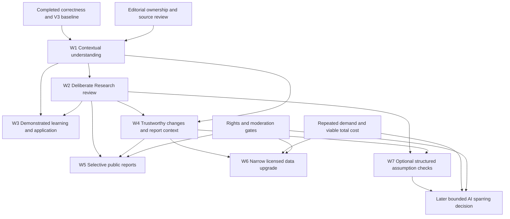

# NTM Master Roadmap 3.0

**Quality compounding · 50 → 100 · Planning only · 18 September 2026**

Baseline inspected: repository commit `88ac5186`. This document authorizes no implementation, migration, purchase, publication or deployment. The numbers 50 and 100 are a maturity metaphor, not measured product scores. All proposed thresholds and pilot sizes below are decision gates to test, not established user statistics.

## 1. Executive product thesis

NTM should become exceptionally good at helping an individual understand an investment question, express a testable decision, preserve its basis, and return to review it honestly. Learning should improve the next decision; saved decisions should reveal what to learn next. Sharing is an optional output of useful work.

The core loop is **understand → formulate → test assumptions → save reasoning → return for a reason → review changes → learn → optionally share**. Acquisition should lead from a useful answer to a meaningful action, saved work and a valuable return visit. Neither a login nor public identity is required to begin.

The next phase improves the transitions and substance of this loop. Keep canonical Visual V3: A2.1 Midnight / Electric composition and A2.2 typography. Do not reopen art direction. Preserve Wave 0 correctness and Wave 1A structural improvements. “Minimal för ögat. Djup för hjärnan” means one relevant next action with inspectable evidence underneath, not another dashboard of every capability.

The recommended investment order is: **contextual understanding; deliberate Research follow-up; demonstrated learning; trustworthy report context; selective publication; narrowly justified data upgrades**. Knowledge is infrastructure throughout, with an editorial operation running alongside engineering. A thousand answers without review capacity would weaken the product.

## 2. Current product map and evidence baseline

### What exists

| Product job | Existing surfaces and capabilities | Remaining boundary |
| --- | --- | --- |
| Orient and discover | Homepage, tools directory, content/posts, resources, shared navigation | Several entry routes describe similar next steps; usefulness must be tested as a journey, not inferred from route count. |
| Calculate and compare | Twelve calculator routes, multiple modes, explicit calculation states, charts/tables, progressive depth, saved scenarios and savings follow-up | Context and persistence are uneven across modes; a tool opening does not prove an applied decision. |
| Understand | Knowledge landing plus 26 reviewed seed answers; Fråga NTM retrieval, aliases, sources, abstention | Small coverage, no broad intent/clarification model or reviewed-content maintenance operation at scale. |
| Learn and practice | 29 Academy lessons and 29 activity pages, paths, roadmap, cases, quizzes, local history, XP/levels | Completion and correct attempts exist; independent, delayed and transfer evidence are not represented sufficiently to establish competence. |
| Research and decide | Twelve stock datasets; manual theses; valuation, provenance, assumptions, falsification, questions, revisions, Change Detection, reviews, outcomes, export | Rich subsystems need one coherent lifecycle; coverage and metric comparability are bounded. |
| Return to work | Min NTM review reasons, saved theses, plans, recent tools, learning, backup | Queue opens company review, not a durable exact revision/reason contract. Visual ordering was already improved. |
| Keep private work | Local persistence, validated backup/import, optional private cloud sync, account/session restoration | Local, synced and public are distinct; Academy is not included in private Research sync. |
| Share selectively | Research-native preview/publish/replace/unpublish, optional public profile, discovery, following, reporting | Public snapshot is a small text allowlist, not a frozen interactive financial report. |
| Follow events | Macro week/event coverage, actual/forecast/previous distinctions, report calendars and readable image transcriptions | Calendars have explicit missing/partial states; earnings transcription is not independently verified comprehensive coverage. |

The site-wide inventory records 121 styled production routes plus a calculator redirect: 59 Academy, 27 Knowledge, 30 general, three social and two Research templates. These counts describe the existing site, not a target to expand. Current stock files are **NVDA, SOFI, CRWD, MU, MRVL, VRT, COHR, RKLB, TTMI, SNDK, FLY and CRWV**. Dataset-level “validated” does not mean every metric or share basis is available and comparable.

### Completed work that must not return as new backlog

- Wave 0 fixed direct-question ranking, FIRE wording, fee-consistent comparisons, Research price provenance and local/sync/public explanations. The 7/10/20 comparison assumptions remain an owner choice; 20% is illustrative, not a forecast.
- Manual company/ticker theses, assumption review dates/statuses, report questions, declined decisions, immutable revisions and process-versus-outcome separation already exist.
- Research publication no longer requires prior private cloud sync. Saved-revision preview and explicit replacement/unpublish exist. The repair report records hosted normal-user verification; this planning task did not establish the current live deployment version.
- Persistent SDK sessions, restoration validation and logout/deletion checks already exist. Earlier memory-only session descriptions are superseded.
- Savings plans already preserve original unrounded inputs and append manual observations. Do not invent a replacement saving system.
- Min NTM hierarchy and the site-wide Visual V3 rollout are completed baseline.

### Evidence and limits

Primary planning sources: [Wave 0](work-audit-wave0.md), [Work Audit cleanup notes](production-cleanup-2026-09.md), [canonical V3](../visual-system-v3.md), [rollout inventory](visual-v3-sitewide-inventory.md), [rollout report](visual-v3-sitewide-report.md), [lifecycle](../research-decision-lifecycle.md), [publication repair](../research-publication-repair.md), [session repair](accounts/session-persistence-release-fix.md), [public profiles](accounts/public-profiles-v1.md), [Knowledge](../knowledge-bank.md), [Academy](../academy-v3.md), [Connected Experience](../connected-experience.md), [calculator quality](../calculator-quality.md), [calculator depth](../calculator-progressive-depth.md), [Research coverage](../research-coverage.md), [weekly reliability](../weekly-data-reliability.md), and [provider framework](growth/data-providers.md).

Implementation checked against those reports: `research-v3.js`, `min-review.js`, `change-detection.js`, `social-core.js`, `research-publication.js`, `cloud-sync.js`, `knowledge-core.js`, `ntm-relations.js`, `ntm-relations-ui.js`, `academy-progress.js`, `academy-activities.js`, `academy-catalog.js`, `ntm-product.js`, calculator HTML defaults and the current stock files. Examples of meaningful distinctions:

- Research already prioritizes a due review over changed data over opening the thesis. Extend this logic; do not claim state-aware actions are absent.
- Change Detection already gates comparisons and uses changes over 1% for supported metrics and over 0.5 percentage points for margins. These are existing display triggers, not validated investment-materiality thresholds.
- Min NTM already suppresses closed/declined attention and acknowledges a reviewed change report. Its current link carries ticker and `review=1`, not a pinned revision and question set.
- Public snapshot fields are company, ticker, thesis, analysis date, selected assumptions, risks, falsification and plain-text sources. They are explicitly projected, never copied wholesale from a private revision.
- Knowledge ranking already distinguishes exact/definition-equivalent questions, aliases and broader overlap. Its public projection excludes editorial internals.
- Academy attempt records currently contain ID, object ID, question ID, correctness and time. They do not establish whether help was used or whether an answer was transferred independently.
- Product events are allowlisted and memory-only, with a queue capped at 100. They are not a deployed longitudinal analytics dataset.

No standalone complete original “Work Audit 2.0” specification was located in the reviewed repository documentation. Its cleanup/Wave 0 reports and the subsequent implementation reports establish the usable baseline. Historical coverage counts, sync-before-publication requirements and the old empty Knowledge fixture must not override current code. This is a repository-based planning audit, not a fresh browser acceptance run, production telemetry study, legal opinion or current external vendor comparison.

## 3. Defensible wedge

**Evidence-backed investment reasoning that gets better through review and learning.** NTM can join reviewed Swedish explanations, explicit assumptions, valuation, falsification, frozen reasoning, source-aware follow-up and selective publication into one unusually coherent workflow.

The differentiator is not any individual calculator, financial ratio or AI response. It is the continuity between “I understand this,” “this is what I believe and why,” and “this is what changed and what I learned.” Repeated use accumulates a useful private history without requiring public performance claims.

This is a strategic hypothesis, not evidence of a moat already achieved. Its defensibility would come from trustworthy linked content, well-tested comparison semantics, editorial discipline and a valuable user-owned reasoning history. Export must remain available; lock-in is not the strategy. Validate the wedge through repeated completed reviews, not registrations or time on site. NTM need not compete with Börsdata, Koyfin, TIKR, Bloomberg, social networks or general assistants across their entire jobs; no unverified feature comparison is required to choose this narrower ambition.

## 4. Anti-goals

- A finance social network optimized for posting, reactions or popularity.
- A stock screener whose appeal is hundreds of ratios regardless of comparability.
- A news portal requiring a constant publishing treadmill.
- A generic AI chatbot that substitutes plausible prose for evidence.
- A course warehouse where completion, XP or certificates stand in for ability.
- A calculator directory whose tools end at an isolated number.
- A public portfolio-performance competition that confuses returns with decision quality.
- An autonomous investment recommender, broker or prediction service.

Fewer URLs is not itself an objective. Keep useful direct destinations and search landing pages. Reduce repeated orientation, duplicated definitions and competing next actions inside the journey. Account owns private utility; Profile owns optional public identity; Research owns investment reasoning; Min NTM owns attention and continuation.

## 5. Maturity map: 50 → 100

“100” below means the intended next maturity level, with observable completion tests. It does not imply perfection or scientifically measured scores.

### 5.1 Product structure

**Job/current:** Help people find and continue the right job. Shared navigation, clear families and V3 hierarchy are strong. Orientation across homepage, tools, learning, Research and Min NTM remains more page-based than task-based. Repeated introductions and generic related links can cost attention; this is a journey hypothesis to validate, not a reason to delete pages.

**Target/gap:** A newcomer can choose understand, calculate or research; a returning user can resume exact saved work. Audit eight representative journeys, assign one owner to every action, and distinguish global destinations from local steps. Homepage should route; it need not summarize the entire inventory.

**Simplify/connect:** Remove redundant explanations once canonical contextual help exists; consolidate competing continuation recommendations. Preserve deep links. Depends on context contracts and observed journey failures.

**Completion:** In an observed pilot, users reach a meaningful result, save where appropriate and resume without being told which subsystem owns the next step; every encountered dead end has an explicit next action or honest stopping point.

### 5.2 Connected Experience

**Job/current:** Preserve intent across products. Curated relations, validation and public ticker selection are strong. Links generally do not transfer financial assumptions. Extending ad hoc URL parameters independently would create hidden state.

**Target/gap:** Small typed handoffs, visible origin, precise units and explicit application of user values; see the contract below. Same-company valuation and exact-review entry are higher value than more related links.

**Simplify/connect:** Extend existing relations rather than build a global state platform. Make generic links contextual only where context exists; retain plain-link fallbacks. Depends on stable IDs, schema validation, storage ownership and Knowledge references.

**Completion:** Each of the eight handoffs below preserves its intended context, rejects invalid/stale payloads and never overwrites work silently. Back navigation preserves the task.

#### Proposed minimal context contract

Separate navigation from content and private work. A versioned envelope contains `kind`, `schemaVersion`, source surface, destination intent, creation time, expiry where transient, and a local return reference. Payloads use only the fields required for their kind:

| Kind | Required meaning | Transport and behavior |
| --- | --- | --- |
| Company | Stable company identity; ticker plus market/currency when known; supported/manual status | Public identity may be in a URL. Do not resolve two companies by similar names. Manual labels remain local. |
| Concept | Canonical concept/answer ID, content version and optional metric definition/period | Safe public ID; opens help without altering inputs. Invalid IDs fall back to search, not a guessed definition. |
| Scenario | Formula/method version; units, currency, horizon, input source and named assumptions | Transient same-browser handoff referenced by an opaque token; preview and explicit “Use these assumptions.” No amounts or private text in query strings. |
| Review target | Local journal and revision IDs, reason IDs, relevant assumption/question IDs, baseline fingerprint | Local reference resolved against current storage. Missing/deleted/version-mismatched targets explain the discrepancy; never silently substitute a newer revision. |
| Learning task | Competency/object/version, labelled synthetic scenario and help policy | Public exercise IDs may travel; submitted answers and correct answers must not be carried to a new attempt. |
| Public report | Public report ID/version, author attribution and eligible company context | Opening Research selects company; copying permitted public assumptions requires explicit action and attribution. |
| Saved calculation | Tool/mode/method version, immutable successful calculation basis and optional plan ID | Reuse existing scenario ownership. Loading is not recalculation; changed methodology requires visible recalculation before a new result is saved. |

Start with only Concept and Company/Scenario kinds in Wave 1; add Review target in Wave 2 and Learning task in Wave 3. The full table is a boundary design, not a mandate to build seven services first. Transient handoffs should have a short documented lifetime, be consumed explicitly, and fail safely across tabs/devices. Persistent work belongs in its established store and backup contract, not the handoff cache.

| Journey | Automatic | Explicit action | Never |
| --- | --- | --- | --- |
| NVDA Research → valuation | Company, currency and intended mode | Preview/use selected EPS, price, growth, horizon and multiple with their dates/provenance | Pretend manual price is live; overwrite a populated calculator |
| Research metric → Knowledge | Specific metric concept; preserve Research state and return target | Optional full article navigation with unsaved-work protection | Send thesis text to retrieval or discard unsaved text |
| Knowledge → Academy | Relevant competency/practice ID | Start attempt | Mark competence from a link click |
| Academy → calculator | Labelled exercise identity | Load synthetic scenario into a clean/confirmed workspace | Blend exercise inputs with personal work; reveal answers through the payload |
| Public Analysis → Research | Same company and report attribution | Create a private interpretation; choose public fields to copy | Import author judgment as verified company data or mutate the public report |
| Min NTM → review | Exact locally resolved revision and reasons | Save review/revision/checkpoint | Review the latest version silently when another was intended |
| Macro → Knowledge | Release concept, geography and period if available | Read deeper context | Treat missing consensus as zero or imply a price forecast |
| Calculator → saved work | Tool and last successful result basis in preview | Name/save, then resume explicitly | Save stale inputs as if they produced the visible result |

Private reasoning, account tokens, portfolio amounts, local IDs and personal questions must never enter analytics, public URLs, public projections or external AI by default. Publication has its own explicit allowlist and consent; it is not a generic context handoff.

### 5.3 Research lifecycle

**Job/current:** Turn a belief into a reviewable decision. Immutable history, manual theses, source snapshots, questions and outcomes are strong. Existing due/change/active actions are a good start. Editing, reviewing, revising and publishing still require understanding separate sections. The inspected flow does not establish a durable resumable draft contract.

**Target/gap:** Derive one main action from state while retaining secondary evidence. A state is an interpretation of existing records, not another mutable status field competing with them. Add bounded local drafts only with restore/discard and clear distinction from saved revisions.

**Simplify/connect:** Merge repeated “what now?” explanations into one action area. Do not replace journals, rewrite history or force a new thesis wizard. Connect Knowledge, valuation, Min NTM and later report publication. Depends on exact-review references and immutable baseline semantics.

**Completion:** Supported and manual-company users can save, leave, resume, review, keep/revise/close/decline and record an outcome without losing context or rewriting their prior reasoning.

| State/condition | Primary action | Evidence and secondary behavior |
| --- | --- | --- |
| No thesis | Formulate first case | Minimal thesis plus optional guided assumption; clearly separate example data from personal work. |
| Unsaved draft | Continue draft | Local-only label, last edit, restore/discard; leaving or importing must not lose it silently. Saving creates a revision only deliberately. |
| Active | Open current case | Current revision, assumptions, next chosen date; no invented urgency. |
| Review due | Review selected assumptions/thesis | Exact date/reason and baseline; due outranks informational data changes. |
| New comparable data | Inspect what changed | Before/after, period, source, comparability and blocked comparisons; no automatic conclusion. |
| Thesis update | Compare and save new version | What changed in reasoning and inputs; preserve old revision and unresolved questions intentionally. |
| Checkpoint | Record decision and reason | Keep/revise/close/decline; process evidence separate from price. |
| Outcome | Compare expectation, process and result | Frozen original basis, dated manual or licensed prices, limitations; profit does not prove a sound process. |
| Archived/closed or declined | Read history or explicitly reopen | Excluded from active attention; reopening does not silently save a new position. Do not add a second archive system. |

When states overlap: unresolved restore/conflict/error first, then exact requested review, due review, unacknowledged comparable changes, unfinished draft, active continuation. A blocking storage problem must not masquerade as an empty portfolio. The user can still inspect history. Public-version lag is secondary unless the user is managing publication.

### 5.4 Deterministic Research intelligence

**Job/current:** Explain what deserves inspection without making the investment decision. Dates, questions, changed fundamentals and filings already supply useful rules. Current free-text falsification is not machine-evaluable. Duplicating alerts or describing broad changes as “material” would reduce trust.

**Target/gap:** Evidence-first rule results with stable fingerprints, reason, baseline, comparability, rule version and acknowledged/snoozed state. Future structured criteria are optional; no NLP masquerading as deterministic truth. The rule register below defines the scope.

**Simplify/connect:** One queue item per thesis with grouped reasons; distinguish action required from optional observations. Reuse snapshot comparison. Research owns detail; Min NTM shows only actionable summaries. Depends on normalized data and structured fields for advanced rules.

**Completion:** Each emitted reason is reproducible from visible inputs, can be acknowledged appropriately, stays quiet after review of the same evidence and returns only for a new relevant condition.

#### Rule register

All rules: missing or incomparable data yields “cannot assess,” not “no problem.” Dismissal hides attention, never deletes evidence. Exact condition/evidence fingerprints prevent recurring identical prompts. A later event can reopen a reason; automatic time passage does not alter a thesis. Thresholds below require methodology ownership before release.

| Rule and stage | Inputs and deterministic logic | Example user message and evidence | False-positive risk and dismissal | Placement |
| --- | --- | --- | --- | --- |
| R1 New filing; existing, refine W2 | Supported filing accession/date versus reviewed baseline; deduplicate accession, distinguish amendment/restatement; current comparator already detects later 10-K/10-Q filings | “En ny rapport finns sedan din granskning.” Show form, accession, filing/report dates and source link. | New filing need not alter thesis; wrong capture date can mislead. Acknowledge this accession, not all future filings. | Research; Min NTM grouped with new data |
| R2 Comparable metric change; existing, refine W2 | Existing snapshot/current metric, same definition/unit/period/share basis; retain disclosed existing >1% / >0.5 pp triggers pending deliberate method review; zero baseline uses absolute change | “TTM-intäkterna skiljer sig från ditt sparade underlag.” Show both values, periods, absolute/percentage change, sources and blocked comparisons. | Rounding/restatement/profile changes, threshold ≠ investment significance. Acknowledge comparison fingerprint. | Research; Min NTM only unreviewed eligible change |
| R3 Valuation input freshness; W2 provenance, later automation | Explicit price observation date/source and chosen freshness policy. Missing date → unknown age. Saved revision time is never quote time. No default universal day limit. | “Prisets observationsdatum saknas” or “Priset är äldre än din valda gräns.” Show entered price/date and policy. | Historical scenario may intentionally use old price. Mark historical scenario or acknowledge until price/policy changes. | Research inline; Min NTM only if user requested a reminder |
| R4 Shared assumption exposure; later | Explicit user-created assumption group IDs shared across active revisions; never fuzzy-match text | “Två aktiva teser använder samma antagande.” Show chosen group and relevant revisions locally. | Reuse may be intentional and does not quantify portfolio risk. Dismiss group/version or unlink explicitly. | Research only initially |
| R5 Structured assumption inconsistency; later | Two explicitly linked inputs representing same metric/unit/horizon but different values beyond documented tolerance | “Tes och värdering använder olika EPS-tillväxt för samma period.” Show both inputs and origin. | Different scenarios can be intentional; require same scenario/basis before firing. Confirm intentional difference, scoped to versions. | Research; no default queue alert |
| R6 Per-share divergence; W4 | Comparable positive-base company metric and its corresponding per-share metric across the same periods; growth gap beyond disclosed display tolerance | “Vinsten växer snabbare än vinsten per aktie.” Show series, growth math, share denominator and dilution context. | Negative bases, split errors, weighted versus point-in-time shares; block rather than infer. Acknowledge period pair. | Research evidence profile; Min NTM only if linked to a chosen criterion |
| R7 Unanswered question; existing, refine W2 | Open question IDs; no deadline unless explicitly set by user in a future structured extension | “Du har två öppna frågor.” Show question and creation/context; do not say overdue. | Deliberately long-running questions. Keep, answer or snooze locally; no forced answer. | Research; low-priority Min NTM grouped reason |
| R8 Missing evidence; later bounded checklist | User-designated claim/assumption requires a source reference, but none is attached. Presence check only. | “Det här antagandet saknar en kopplad källa.” Show the field and what qualifies as a reference. | Some assumptions are author judgments; a link does not prove support. Mark as judgment, attach or dismiss. | Research inline; no global alarm |
| R9 Review date; existing, refine W2 | Active non-superseded thesis/assumption date reached, with no qualifying later review; use explicit local calendar-date convention | “Ditt granskningsdatum har nåtts.” Show date, criterion and last review. | User-selected date can become irrelevant; clock/time-zone changes. Reschedule/snooze/review, retaining history. | Research and Min NTM, high priority |
| R10 Structured threshold; later | Optional metric ID/operator/threshold/unit/period plus comparable observation and source; evaluate only explicit structured conditions | “Ditt villkor rörelsemarginal under 15% är uppfyllt.” Show 14%, period, source and saved condition. | Report restatement, mismatched quarter/TTM, wrong sector metric. Acknowledge observation, revise criterion in a new revision. | Research and Min NTM if user enabled criterion |
| R11 Conclusion changed; later | Explicit structured conclusion code changed between revisions while linked assumption IDs/values remain unchanged | “Din slutsats ändrades; vill du dokumentera varför?” Show before/after and unchanged linked assumptions. | A valid decision can change for other reasons. Optional explanation or dismiss; never block saving. No inference from edited prose. | Research save-time only |
| R12 Source correction/change; W4 | Same normalized fact identity now references different source/version/value or a formally flagged correction; fetch time alone does not count | “Källunderlaget för den sparade uppgiften har reviderats.” Show old/new accession and derived calculations affected. | Equivalent mappings or cosmetic source changes. Acknowledge specific correction; preserve old snapshot. | Research; Min NTM only when an active linked assumption is affected |

### 5.5 Public Research V2 — design, not implementation

**Job/current:** Let useful private work become an explicitly chosen public snapshot. Current allowlist, revision preview, optional profile, replacement and unpublish are strong; prior publication failure was repaired. Current text reports lack frozen financial context and chart semantics. A richer report enlarges privacy, licensing and moderation exposure.

**Target/gap:** Company/author/date/version → investment case → financial context/history → assumptions/valuation → what could make this wrong → follow-up → sources. Label each element **Bolagsrapporterad data**, **NTM-beräkning**, **Författarens antagande** or **Författarens bedömning**. Manual inputs need their own explicit provenance label, not “reported.”

**Simplify/connect:** One report model with concise summary and optional depth, not competing short/long publishing products. Keep current publication usable while V2 is designed. Depends on frozen metric/valuation contracts, rights and operational moderation. Profile foregrounds authored work, not follower totals; discovery helps find relevant reports without popularity ranking.

**Completion:** A reader can distinguish fact from opinion, reconstruct a displayed calculation, identify the version/date, and start a private interpretation. A publisher can predict exactly what becomes public and prove later private edits do not change it.

#### Proposed publication boundary

Eligible only through an explicit selection/preview: existing public fields; an author-written summary; selected assumptions and falsification; deliberately selected follow-up commentary; permitted financial observations; named scenarios and calculation outputs with method/input basis; source links and clear provenance. “Eligible” does not mean automatically selected. Existing mandatory fields remain explicit.

Never automatically publish: complete private revision history, drafts, private notes/report questions, review queue, behavioral journal, account/auth identity, email, cloud metadata, local storage keys, internal correlation IDs, personal portfolio size/cost basis, private outcomes, other users' work, hidden source annotations, licensed data without redistribution rights. Private material can be deliberately rewritten into public prose; the system must not expose its private record by reference.

Freeze an immutable **report version** containing selected content, eligible observations, period/unit/currency/share basis, source/accession, source date, calculation method/version and publication timestamp. Keep a stable public report identity with a current-version pointer. The first V2 release need not expose a browsable public archive of withdrawn versions: retention, unpublish and correction semantics must be decided before schema work. Never promise erasure from screenshots, search caches or third parties.

Private revision → preview → publish creates a version. New private saves do nothing publicly. Republish shows a diff, creates a new frozen version and marks its date; unpublish removes public availability under the defined retention policy while preserving private work. Corrections remain visible where needed without exposing withdrawn personal information. Existing V1 reports remain readable and can be upgraded only through explicit republishing.

Charts use frozen observations, distinguish annual/quarterly/TTM and modelled scenarios, show missing periods as gaps, preserve comparable share/currency bases, and expose the exact table and sources. No live quote should silently enter a historical report. Interactive controls must say when they produce a reader's temporary scenario rather than the author's published calculation; reader changes never mutate the report.

Mobile: readable summary first, section anchors, keyboard-accessible disclosures, scrollable labelled tables only where needed, chart alternatives, source access without trapping navigation. “Long/short” primarily means report length; if directional long/short stances are later offered, label them as author opinion and never infer a holding. Public SEO comes only after canonical URLs/version rules, permission, moderation and useful substantive reports are established. Reporting/takedown ownership, source-rights complaints, misleading claims and abuse handling precede promotion at scale.

### 5.6 Min NTM and repeat use

**Job/current:** Answer “what needs attention?” and “where should I continue?” Existing local reminders, active/inactive separation, plans and improved visual ordering are strong. Queue reasons still converge on a broad review link; open questions can feel equally urgent as a due review.

**Target/gap:** Group reasons by thesis; separate due action, optional observation and continuation. Exact review target, bounded draft continuation, saved-plan observation and appropriate learning retrieval. Public-version lag belongs under publication management, not a red global badge.

**Simplify/connect:** No daily streak, unread-count treadmill or background notification system. Collapse secondary history/backup; preserve their findability. Depends on lifecycle/reason contracts, learning evidence and existing storage.

**Completion:** After resolving a reason, returning shows no duplicate prompt for that evidence. Inactive work stays quiet. Data failure is distinguished from “nothing to review.” A user can resume a plan or thesis in one deliberate action.

### 5.7 Knowledge Engine and Fråga NTM

**Job/current:** Supply reviewed explanations everywhere. The 26-object seed, aliases, deterministic ranking, abstention, source projection and status gates are strong. Coverage and editorial review depth are the main limits; seed review is not evidence of independent human subject-matter review. A single FAQ list and string overlap alone will not scale.

**Target/gap:** One canonical concept with distinct reviewed answer intents and reusable sections, not one giant article or duplicated definitions. Definitions, calculation, interpretation, comparison and limitations must remain distinguishable. Build the minimal schema extension and editorial workflow below before mass authoring.

**Simplify/connect:** Preserve stable answer IDs/URLs and current catalog; do not replace it with a knowledge graph database or live LLM. Remove redundant definitions gradually as consumers adopt reviewed excerpts. Depends on editorial ownership, source governance, contextual rendering and retrieval evaluation.

**Completion:** The same versioned explanation serves Research, tools and learning correctly; a fixed evaluation set returns the intended reviewed answer or a useful clarification/abstention. Every visible object has an accountable review state and correction path.

#### Canonical object model

Keep a small `concept` record (stable ID, preferred Swedish term, synonyms, related concepts) and existing `answer` records (stable ID/slug, concept references, question, intent, aliases, short answer, full explanation, sources, relationships). Multiple questions can share a concept without pretending “what is P/E?” and “is P/E 40 expensive?” are equivalent.

Add optional typed sections only when needed: formula with variable/unit definitions; worked example with independently checked inputs/results; interpretation; mistakes; limitations and unsuitable cases; reviewed comparison; approved inline excerpt. Add content version, review owner, review due date, change note, source observation/review dates and applicable jurisdiction/year/method version. Reuse the existing rule registry for time-sensitive tax/rule values. Keep internal drafting/reviewer notes out of the public projection.

Source records need claim/section association, primary-source preference, what was checked, and a known limitation. A source URL alone is not review. Version the authored content separately from retrieval ranking; a synonym correction should not fabricate a new substantive financial claim. Preserve redirects for merged answers and record why they were merged.

#### Deterministic assistance path

1. **Current V1:** reviewed retrieval, definition normalization, aliases, ranking and abstention. Preserve the repaired exact-question behavior.
2. **Bounded V2:** reviewed intent vocabulary; curated typo aliases first, then conservative edit-distance suggestions only when unambiguous; never silently turn EPS into a different short financial acronym. One clarification with two or three reviewed choices when intent is ambiguous.
3. **Comparisons:** serve a reviewed comparison object or explicitly juxtapose approved sections; do not synthesize an unsupported conclusion from two definitions.
4. **Supplied numbers:** only approved formula templates with validated units and explicit user inputs. “Price 100, EPS 5” can show P/E 20 under that basis. Negative/missing EPS triggers the reviewed limitation. No storage or analytics of raw questions/numbers by default.
5. **Contextual help:** use a public metric/concept identifier, not private prose. For “Är P/E 40 dyrt?”, explain the need for earnings basis, growth, risk and comparison context; route to forward/trailing and valuation material. Do not output a universal expensive/cheap verdict.
6. **Abstain:** distinguish missing coverage, ambiguous intent and unsupported personal judgment. Offer relevant reviewed choices or a voluntary question-submission route only after its privacy/retention policy exists.

At 100 objects, curated intent coverage and a generated local index suffice. At 500, use bounded category/concept browse, task-oriented landing views, search evaluation and measured payload budgets. At 1,000+, partition/load the public index if measurements justify it; never render all answers initially. Scale the review queue before scaling object count. Counts are milestones in reviewed coverage, not publication quotas.

### 5.8 Academy and mastery

**Job/current:** Help beginners become more capable investors. Existing practice, cases, deterministic grading, history and anti-XP-farming behavior are strong. Roadmap, paths, skills, levels and progress compete as orientation systems. Self-marked lessons and self-reviewed prose cannot prove reasoning quality.

**Target/gap:** Competency → next useful task → independent attempt → feedback → different application → delayed retrieval. Define conservative states: **Introducerat** (encountered), **Övat** (attempted with feedback/help allowed), **Visat förståelse** (met explicit evidence requirements for a versioned competency). This last label is bounded evidence, not professional mastery.

**Simplify/connect:** Competencies become primary; paths are curated sequences through them; roadmap is their overview. Skills become a view of competencies rather than a second scoring system. XP/levels remain secondary activity history; do not erase prior rewards or reinterpret them as competence. Prerequisites guide rather than lock access.

**Gap/dependencies:** Record attempt sequence, task version, help/answer exposure, variant, independent status and delayed/transfer context. Old records remain activity evidence, never retroactively independent. Use new examples, not identical recall of a revealed answer. Self-reviewed case prose remains self-report unless reviewed by a person under a rubric. Connect Knowledge reminders without revealing answers, calculator scenarios and optional Research applications.

**Completion:** A learner can see why a competency is labelled demonstrated, fail a new delayed check without losing history, and receive an appropriate next task. Hundreds of objects map to a small visible set of competencies; only the next relevant few tasks are offered.

### 5.9 Fundamental Profile

**Job/current:** Help users interpret available fundamentals. Research has normalized reported/derived observations, provenance, comparability checks and a revenue overview. It does not need a composite 87/100 score. Incomplete periods, share bases and company-type differences restrict conclusions.

**Target/gap:** Evidence statements across growth, profitability, cash generation, balance sheet, per-share development, valuation, fundamental momentum and separately data quality. Each statement includes period, values, comparison basis and method. “Insufficient evidence” is a legitimate result.

**Simplify/connect:** Avoid repeating every raw ratio or assigning all companies one rubric. Start with a few supported statements and progressive detail. Depends on existing normalization plus explicit statement eligibility and source correction behavior, not necessarily paid prices.

**Completion:** Every statement can be reconstructed; negative bases, incompatible periods and unsuitable profiles fail closed. Valuation remains unavailable without a suitable dated price/input basis. Data quality never raises or lowers a company-quality score.

| Dimension | Initial evidence | Required restriction |
| --- | --- | --- |
| Growth | Comparable revenue/profit changes | Same duration, definitions, currency and positive baseline for percentage interpretation |
| Profitability | Margin levels and period-to-period movement | Appropriate company profile; no bank/industrial comparison by default |
| Cash generation | Operating cash flow/FCF and reconciliation | FCF definition and exclusions visible; not automatically comparable across industries |
| Balance sheet | Dated cash/debt components | Missing components remain missing; cash is not automatically freely available |
| Per-share | EPS/FCF per-share versus total metric | Verified denominator/split basis; weighted-average shares are not current market-cap shares |
| Valuation | User scenario or dated licensed observation | Separate price date, forecast basis and author assumptions; no cheap/expensive universal label |
| Fundamental momentum | Direction across comparable reported periods | No stock-price prediction; adequate history and revisions handled |
| Data quality | Coverage, age, blocked comparisons, source/method | Separate diagnostic, never an investment-quality rating |

Before any “Stark/Neutral/Svag” labels: document comparator, exact period, thresholds, eligible company type/sector, minimum evidence and methodology version; validate counterexamples. Until then, publish descriptive statements only.

### 5.10 Data expansion

**Job/current:** Supply enough trustworthy data to support a decision and review. Twelve SEC-based datasets, provenance and unavailable states are valuable. They are not comprehensive coverage, current prices, verified point-in-time shares or analyst consensus. Current dated manual valuation inputs are honest and useful.

**Target/gap:** Upgrade the bottleneck observed in actual reviews, using narrow licensed scope and resilient delivery. Stage and rights gates are in section 10.

**Simplify/connect:** No provider shopping as a substitute for product discovery, no widget scraping, no undefined “real-time.” Retain manual paths and limit supported claims. Depends on rights, total cost, source adapters, comparison methodology and demonstrated demand.

**Completion:** A failing upstream source cannot produce fake freshness or alter frozen work; every new field has a source/time/method/rights basis and demonstrably removes a recurring user obstacle.

### 5.11 Calculator family

**Job/current:** Answer a specific quantitative question with inspectable assumptions. Explicit stale/error states, progressive depth, sensitivity and existing saved plans are strong. The family is not uniformly certified across every mode; generic inputs and transitions still fragment the journey.

**Target/gap:** One shared maturity bar, applied selectively rather than a universal redesign. A result states unit/horizon, input basis, what changes it, relevant limits and the next meaningful action. Default values are examples, not recommendations. Comparisons hold all irrelevant assumptions equal. A chart earns its space only if it answers a question; a table or plain result can be better.

**Simplify/connect:** Required inputs stay visible; formulas and repetitive explanation move into existing depth patterns. Reuse Knowledge definitions and existing storage. Add saving only for work worth resuming; do not create twelve plan managers. Depends on contextual handoffs, formula-specific tests and editorial method review.

**Completion:** Each changed mode passes independent numerical cases, invalid/stale transitions, chart/table/result agreement, keyboard and 320/390-pixel mobile use in both themes. Saved work reopens the original basis without silently applying new rules.

The following is a planning assessment from existing implementation/reports and HTML defaults, not a new exhaustive numerical/browser certification. **Near maturity** means targeted integration work; **deeper work** means significant workflow/model explanation work, not a known arithmetic defect.

| Calculator / core question | Current inputs/defaults and strength | Result/comparison/chart/depth/method gap; simplification | Knowledge / Academy / save / mobile next step | Priority |
| --- | --- | --- | --- | --- |
| Compound growth + dividend mode: what could saving become? | Growth example 100,000 + 3,000/month, 7%, 0.5% fee, 2.5% inflation, 10 years. Dividend mode separately includes yield/growth; comparisons corrected for fees. | Keep nominal/real and total-return/dividend assumptions distinct; explain cash-flow timing once. Preserve deliberate 7/10/20 examples and custom-path comparison suppression. Compare endpoint and contributions, not only attractive curves. | Canonical compounding/fees/inflation; labelled Academy scenario; reuse saved scenarios with method basis. Mobile modes and chart alternatives. | Near maturity; W1/W3 integration |
| Fees: how much do costs change the same plan? | 100,000 + 3,000/month, 7%, 30 years, 0.20% versus 0.50%. Like-for-like comparison is the main job. | Show final difference and cumulative cost interpretation without implying fee alone determines investment choice. Audit chart/table distinction between paid fees and lost compounding. Collapse repeated formula prose. | Fee concept and controlled comparison exercise; optional reuse of existing scenario system if repeat use demonstrated. Mobile paired results. | Near maturity; W3 |
| Leverage: what happens with borrowing or daily reset? | Borrowing example equity 1m, debt 250k/20% LTV, 3.5% rate, 7%, 15 years; daily example 100k, 3x, zero daily fee. Distinct modes exist. | Strong boundary tests exist; mode confusion remains a high-risk teaching problem. Make borrowing versus daily reset intent explicit; compare downside and financing assumptions. Retain correct path-dependence explanation, not false return-order claims. | Leverage/daily-reset concepts; independent adverse-path exercise. Save a labelled scenario only, never an implied trading plan. Mobile long tables and mode selection. | Deeper workflow work; W3 bounded case, rest later |
| Stock valuation: what assumptions support this price/return? | EPS/price/growth/multiple/horizon; example 100/4, 15%, five years, P/E 25; scenario and reverse modes. | Main gap is same-company input provenance and round trip to Research. Show required assumptions and sensitivity, not intrinsic-value certainty. Maintain negative/unavailable EPS gates and separate scenarios. | P/E/EPS/reverse valuation; Research handoff and Academy transfer task; save chosen basis with thesis. Mobile scenario comparison/table. | Highest integration priority; W1–W3 |
| Return/CAGR: how much did value grow? | Total 100k→150k; CAGR 100k→275k over 3y6m; annual sequence examples. | Clarify cash-flow-free assumptions and arithmetic versus compounded rates; do not infer portfolio performance with deposits. Prefer a small comparison/table over extra charts. | CAGR versus arithmetic-return practice; shareable synthetic exercise, usually no durable plan needed. Mobile duration inputs. | Near maturity; W3 |
| Purchase/GAV/DCA/position sizing: what does this transaction imply? | GAV 100 shares at 50, add 40 at 35, optional brokerage/flat FX cost; position 500k, 1% risk, entry100/stop90. | Separate arithmetic cost basis from a reason to buy; stop price is not guaranteed loss limit. Preserve cost and currency explanation; GAV→manual thesis already exists. | Cost basis and position risk; labelled gap-loss exercise. Optional selected assumption handoff, no public holdings or broker connection. Mobile multirow DCA. | Deeper intent/context work; after W3 pilot |
| Savings goal: what contribution/time/capital is needed? | Three modes; 1m target, example7%, fee/inflation0; explicit successful-plan saving and append-only observations. | Already among strongest workflows. Improve explanation of scenario deviation and real-money observation basis; no forecast from deviations. Avoid rebuilding plans. | Goal/inflation help; Academy planning task; resume exact plan from Min NTM. Mobile observation entry and comparison. | Near maturity; W1 help, W3 continuation |
| Mortgage: what payment/amortization follows these assumptions? | Home3m, cash450k, rate3.5%; separate loan/amortization/rate modes and rule-based/custom rates. | Separate interest cost, amortization and cash outflow; bank assessment stays outside model. Rule freshness and exact boundary behavior matter more than more charts. Default is illustrative, not eligibility. | Amortization/interest definitions, rate-stress exercise. Save only a dated scenario if repeated comparison warrants it. Mobile input/result comparison. | Method maintenance first; later focused integration |
| FIRE: what capital/timing/withdrawals follow my scenario? | Expenses25k/month, capital500k, savings10k, age30, nominal7%, inflation2%, withdrawal4%; withdrawal mode separate. Corrected fixed-real withdrawal wording and sensitivity exist. | Preserve distinction between capital target and simulation; smooth paths provide no success probability. Keep sensitivity and sequence-risk depth; remove repeated disclaimers, not assumptions. | Inflation/withdrawal/sequence-risk knowledge and stress task. Reuse scenario basis if saving is supported; no new retirement planner. Mobile horizon/results. | Near maturity; targeted W3/later |
| ISK tax: what estimate follows a year and capital basis? | Example basis500k, detailed quarterly/deposit inputs and allowance used; registry-backed rules. | Year/rule/allowance provenance is primary. No result presented as tax filing or all-account optimization. Use clear breakdown rather than ornamental chart. | Canonical year-aware explanation; synthetic allowance exercise. Saved estimates, if added, retain rule year/version. Mobile detailed mode. | Near maturity with recurring editorial duty |
| Recovery: what gain offsets this loss? | Default50% decline, optional100k; handles total loss and extreme boundaries. | A compact answer plus one example is enough. No history dashboard or extra chart required. Explicitly distinguish percentage bases. | Recovery concept and independent loss/recovery exercise. No mandatory save feature. Mobile single-task clarity. | Near maturity; minimal changes |
| FX-adjusted return: what did currency add or subtract? | Asset20%; rate10.50→9.60 or currency−8.57%; optional100k. Concrete multiplicative example/depth already exists. | Maintain asset move, FX move and percentage-point contribution distinction. Label manual reference rates and direction; no claim of live conversion. | FX concept and unseen numerical example; optional scenario handoff. Mobile rate direction and comparison. | Near maturity; W3 |

Across all rows: audit units, defaults and boundaries before adding comparison; offer at most one relevant learning/action link plus optional depth; save only successful current calculations. Advanced modes must retain their existing method-specific behavior. This roadmap does not assert that every calculator currently supports the same save contract.

### 5.12 Macro and Earnings

**Job/current:** Explain the events worth checking and their implications for a user's research. Macro prioritization, truthful missing/partial weeks, source fields and time handling are strong. Earnings calendars include readable transcriptions but are not comprehensive verified schedules. More rows would not fix that.

**Target/gap:** Visible coverage universe/time window, source confidence, issuer-confirmed versus provisional date/session, explicit time zone, scheduled/actual/revised state, previous-as-first-reported versus revised when available. Macro consensus remains absent unless licensed/sourced; no fabricated surprise calculation.

**Simplify/connect:** Default to important releases and relevant supported-company reports; retain full browse as depth. Link CPI, payrolls and report concepts to canonical Knowledge. Avoid a macro sentiment score or stock-price prediction. Depends on provenance, source operations and date reliability; licensed earnings dates only if justified.

**Completion:** A user can tell what is covered, what is missing, when it was checked and whether a value/date changed. Year/week and Stockholm/daylight-saving boundaries work; failed updates cannot masquerade as fresh calendars.

### 5.13 Accounts, Profiles and Discovery

**Job/current:** Keep work recoverable and sharing optional. Session repair, explicit sync, allowlisted publication and account deletion paths are substantial strengths. Account/private/cloud/public distinctions remain a comprehension risk; richer social infrastructure is not a reason to expand social scope.

**Target/gap:** Observed login/resume/sync/conflict/publication/unpublish journeys with understandable ownership and failure recovery. Profile presents useful published work; discovery explains company/topic/date/version relevance. Following may remain a quiet utility; no feed expansion is implied.

**Simplify/connect:** Healthy sync state stays quiet. Do not turn Account into another Min NTM or Profile into a private-work dashboard. No forced profile to calculate/learn/save locally. Depends on persistence contracts, moderation and future report schema.

**Completion:** A user correctly predicts which action stays local, syncs privately or publishes; restart/session expiry/conflict/offline behavior never causes silent loss or unintended upload. Existing hosted repair evidence is preserved and rechecked only when relevant changes require it.

### 5.14 Trust and methodology

**Job/current:** Make product claims inspectable. Provenance, explicit missing values, immutable snapshots, backups and Wave 0 corrections are strong. Review/source ownership across content and data is still an operational burden; current documentation does not establish that the proposed contact mailbox is configured and monitored.

**Target/gap:** Reported/calculated/manual/modelled provenance at use, source and method version, age/missing-data behavior, accountable corrections and clear public/private boundaries. Establish a monitored correction route and triage ownership before advertising it. Exports preserve IDs, units, versions and provenance within rights.

**Simplify/connect:** Trust through behavior, not repetitive disclaimer volume. Centralize definitions and rules while keeping consequential assumptions beside results. Depends on every wave's acceptance criteria and an editorial/data operator.

**Completion:** A submitted correction can be tracked from triage to affected content/data/calculations; users can identify stale or revised material and recover/export their private work without guessing.

### 5.15 Distribution ecosystem

**Job/current:** Bring the right users to useful work and learn from discussion. Website content, relation metadata and manual distribution foundations exist. Templates and metadata do not prove an operating audience loop, successful campaign or installed bot.

**Target/gap:** One researched idea produces a canonical website object, an appropriate Instagram explanation and, when discussion is useful, a Discord prompt. Each destination has one purpose and a relevant next action.

**Simplify/connect:** Not every idea needs every format. Avoid reposting entire objects mechanically. Depends on reviewed canonical content, owner editorial judgment and coarse campaign evaluation.

**Completion:** Selected posts lead to an observed useful answer/action; community questions return to the editorial queue with consent and without publicizing private investment details. Automation reduces proven repetitive work, not creates more publishing obligations.

## 6. Dependency graph and critical paths

Context and Knowledge contracts precede reuse; they do not require a platform rewrite. Research's exact revision/reason contract precedes a better Min NTM queue. Mastery evidence precedes mass Academy production. Public financial snapshots require comparable data and rights, but the current text publication workflow remains usable throughout. Descriptive Fundamental Profile statements can use existing eligible SEC facts; paid feeds are not their prerequisite.

Forward valuation based on third-party expectations requires dated licensed estimates, fiscal-period alignment, currency and share-basis consistency plus a suitable price. EOD prices alone do not establish consensus, corporate-action history or EV. Structured checks need structured user criteria; AI cannot substitute for that missing evidence model.

The recommended sequence manages limited owner review capacity. Content/source review, manual pilot observation and rights diligence can run alongside engineering, but failing a dependency gate stops dependent scope. Later waves can be skipped if they fail to improve the core loop.

## 7. Master roadmap: sequential implementation waves

Detailed briefs for Waves 1–3 are in section 17; those definitions are part of these wave scopes.

| Wave | Objective and user problem | Systems and exact scope | Non-goals / dependencies | Risks, impact, validation and completion |
| --- | --- | --- | --- | --- |
| **1 — Understand without losing the task** | Get a trustworthy explanation and apply it without restarting work | Minimal concept/answer version extension; 12-concept review pilot; inline Knowledge in Research/valuation/savings; company/scenario preview handoff; return and unsaved-work protection | No new design, mass content generation, AI, account changes or generic state platform. Requires editorial owner and baseline fixtures. | Risk: wrong basis/hidden overwrite. Impact: coherent answer→action journey. Validate retrieval, units, context loss, privacy and mobile; complete when end-to-end pilot criteria in §17 pass. |
| **2 — Return and complete a deliberate review** | Know why to return, inspect exact evidence and finish the review | Derived lifecycle selector, local draft contract, exact revision/reason resolution, grouped Min NTM queue, existing R1/R2/R7/R9 refinement, R3 provenance, review closure and outcome continuation | No auto-evaluated prose, paid feeds, public schema or notification platform. Depends on W1 context conventions and existing journal compatibility. | Risk: duplicate prompts/history loss. Impact: useful repeat visits. Validate stale targets, manual companies, storage/backup and due→decision journeys; complete when prior evidence stays quiet after review. |
| **3 — Demonstrate understanding through application** | Move from reading/correcting an answer to independently applying it | Three competency pilots; conservative evidence model; new variants/delayed checks; labelled valuation/FX/calculator applications; saved-plan continuation; consolidate competing learning orientation | No bulk lessons, XP reset, certification, universal calculator rewrite or cloud learning sync. Depends on W1 Knowledge/tasks and W2 private-work boundaries. | Risk: false mastery or answer leakage. Impact: learning improves actual decisions. Validate first/helped/delayed/transfer evidence and affected calculator math/mobile; complete when demonstrations can be explained from records. |
| **4 — Know what changed and why it matters to inspect** | Trust financial and event context without drowning in metrics | Pilot descriptive Fundamental Profile for eligible existing datasets; R6/R12; explicit statement eligibility; macro release/earnings coverage and revision presentation; concept help; correction triage | No score, broad company expansion, paid feed requirement or price prediction. Depends on W1/2, source ownership, comparable fact definitions. | Risk: sector/share/period mismatch and stale calendars. Impact: evidence-rich review. Validate negative/missing/changed bases, restatements, calendar boundaries and failed refreshes. Complete when each claim is reconstructable and unavailable states are truthful. |
| **5 — Publish an inspectable investment report** | Share selected work with financial context and let readers form their own interpretation | Implement approved V2 allowlist/version design only after a separate brief; frozen eligible charts/calculations; preview/diff/republish; mobile sources; report→private interpretation; useful profile/discovery presentation | No feed/comments, automatic publication, default historical public archive or SEO scale push. Depends on W2/4, explicit rights and staffed moderation/retention decisions. | Risk: private leakage, misleading snapshots, takedown complexity. Impact: selective sharing reinforces core utility. Validate adversarial projection, RLS/ownership, old V1 compatibility, freeze/replace/unpublish and reader continuation. Complete when all boundaries and moderation runbook pass. |
| **6 — Remove one proven data bottleneck** | Avoid repeated manual work that demonstrably blocks reviews | Choose one narrow EOD/FX/earnings dataset or cohesive bundle justified by evidence; dated adapter, cache rights, failure handling, manual fallback and licensed snapshot/export semantics | No automatic purchase, all-market coverage, consensus bundle or broker integration. Depends on repeated demand, written rights, approved ceiling and W4 method contracts. | Risk: cost/rights/operational lock-in. Impact: less friction in the proven workflow. Validate provider contract fixtures, age/session/currency errors, outages and actual pilot improvement. Complete only if retained-use benefit and total-cost gate pass; otherwise keep manual workflow. |
| **7 — Test explicit assumptions more precisely** | Compare user-chosen criteria consistently across reviews | Optional structured criteria; R4/R5/R8/R10/R11 in a narrow pilot; evidence-source attachment, versioned acknowledgements and explicit shared groups | No text inference, default alarms, portfolio risk score or AI launch. Depends on W2/4 and demonstrated need for structured checks; W6 only where the chosen rule needs new data. | Risk: burden and false precision. Impact: stronger falsification and fewer forgotten conditions. Validate intentional differences, undefined evidence and changed methods. Complete when users voluntarily use criteria across two reviews and can explain every prompt. |

Knowledge expansion and content maintenance accompany all waves; they are not deferred until after engineering. Calendar/source operations likewise continue regardless of which wave is active. No fixed delivery dates are asserted without capacity estimates and owner review availability. Size each wave around its stated user outcome; stop or cut secondary integrations before expanding the objective.

Prioritization rationale: Waves 1–3 improve current workflows at low recurring data cost and reinforce the learning/reasoning wedge. Wave 4 builds trust before richer publication. Wave 5 benefits distribution but brings operational cost, so it follows private usefulness. Wave 6 is conditional, not a reward for finishing earlier engineering. Wave 7 is worthwhile only if structure reduces actual review friction. AI follows evidence and economics, not novelty.

## 8. NOW / NEXT / LATER / PARKED

**NOW:** Agree this outcome sequence; identify editorial/correction owners; prepare Wave 1's bounded reference set and journey baseline; execute Wave 1 only under a subsequent implementation request. Preserve all completed fixes. Start collecting consented qualitative evidence with existing manual validation templates.

**NEXT:** Waves 2 and 3; reviewed Knowledge expansion toward 100 where observed tasks need it; operational source/correction review; prepare Wave 4 statement definitions. Do not postpone user testing until all three waves are finished.

**LATER:** Waves 4–7 as gated above; 500/1,000 Knowledge objects only with maintenance capacity; richer public SEO after report quality/moderation; historical prices/actions/current shares/EV; licensed estimates; bounded AI sparring if warranted.

**PARKED:** Price predictions; prediction leaderboards; general feed; likes/reactions; general comments; forum; reputation scores; performance leaderboards; broad public portfolios; DMs/private messaging; achievements beyond meaningful learning milestones; broad broker integrations; unlimited AI chat; miscellaneous social gamification. None is a dependency of the proposed near-term work.

## 9. Content roadmap: the Knowledge engine is an editorial product

### Coverage before volume

Build a coverage matrix by **concept × user intent × product context**. Initial clusters: P/E/trailing/forward; EPS and share dilution; company versus per-share growth; FCF and its limits; margins; nominal/real returns; compounding/fees; CAGR/FX; valuation assumptions; falsification/review; macro actual/forecast/previous; source/date/quality distinctions. Existing answers are reused and improved first. The first 12-concept pilot is not necessarily 12 new pages.

At approximately **100 reviewed objects**, cover the most frequent real task questions with independently checked examples, stable concepts and a retrieval evaluation set. At **500**, add depth and comparisons only where question evidence shows a gap, with duplicate detection, reviewer assignment and maintenance capacity. At **1,000+**, demonstrate that review backlog, search precision and payload remain controlled. Pause expansion when overdue substantive reviews cannot be cleared within the owner's agreed operating budget.

Browse should expose task/concept categories and a small number of relevant answers, not inventory. Search should distinguish no coverage from ambiguous intent. At scale, review duplicate candidates by normalized question, aliases, concept/intent collisions and overlapping claims; never auto-merge substantive content.

### Editorial factory

Real question or observed task failure → owner/ChatGPT research draft → claim/source check → independently recomputed example → editorial review → explicit reviewed/published status → concept/product links → optional Academy exercise/Instagram/Discord adaptation → later review/correction.

ChatGPT can assist research and drafting; it cannot be its own independent source or final reviewer. The owner accepts publication responsibility or appoints a competent reviewer. Work/Deep Research is useful for difficult external/source questions. Codex checks schemas, links, projection, examples and build behavior; passing a generator is not substantive editorial approval.

Quality gate per object: one clear question/intent; correct short answer; necessary limits; claim-level sources; checked formula/example and units; provenance/year where applicable; no unsupported personalized conclusion; consistent terminology; reviewer/date/version; relevant next action; no private notes in output; duplicate check; readable mobile excerpt. Comparison content must state its axes and limits. Practice derivations must not expose answers in reminder snippets.

Review cadence is risk-based: tax/rule content on new-year/change triggers; source-sensitive/financial-method content on source change and a scheduled owner-defined review; stable definitions less often. An overdue review must have an explicit policy: label, suppress the affected claim, or move to `needs-update`; never silently refresh the review date. The existing `needs-update` state hides content, so routing must offer a useful fallback.

Reuse a single content version as the reference: short explanation in Research/calculators/Macro/Public Analysis, fuller learning explanation in Academy, source article on the website. Surface-specific introductory sentences may differ; core definitions/formulas should not fork. Instagram uses one defensible idea/example and links to the correct task. Discord invites a focused question, not an engagement prompt attached to every article.

## 10. Data roadmap and purchase gates

Existing provider notes use historical three-company volume assumptions; current stock coverage is twelve. Recompute any quote envelope from the chosen scope. The existing provider framework's zero-spend ceiling is not purchase authorization. No current vendor price, rights grant or provider recommendation is asserted here.

| Stage | Value and affected features | Method, freshness and failure behavior | Rights, cost and demand gate |
| --- | --- | --- | --- |
| **Current: verified historical fundamentals** | Research comparisons, eligible descriptive profiles, selected report facts | SEC report/accession/period; reported versus derived; profile-specific metrics; explicit missing/unverified share basis. Fetch success ≠ all metrics current. Preserve last known dated data with stale status when refresh fails. | Maintain current source inventory and investigate unresolved uses. Dataset validation is not licensing clearance. Improve existing coverage before widening it. |
| **Next: narrow EOD price, reference FX, reliable earnings dates** | Reduce manual price/date entry and align valuation/event context | Distinguish close timestamp, exchange session, currency and retrieval time; holiday/weekend age; FX pair/direction/date; confirmed/provisional earnings time zone. On failure show dated stale input/manual option, never invented freshness. | Require repeated observed blockage, a scoped public-display quote, cache/static JSON, frozen snapshots/export and attribution rights. Include exchange/per-user/support costs. Buy one justified scope, not a broad bundle by default. |
| **Then: history, corporate actions, appropriate current shares** | Reproducible price outcomes, split alignment, eligible market cap/EV | Specify adjusted/unadjusted prices and dividend treatment; restatements/actions; point-in-time shares versus weighted EPS denominator; align cash/debt dates and EV components. Missing components block composite values. | Historical retention, redistribution and derived-data rights; backfill/update cost, delisted coverage and termination policy. Gate on users actually completing reviews requiring history/EV, not chart appeal. |
| **Later/premium: estimates and revisions** | Compare author assumptions with dated external expectations; credible forward valuation | Fiscal/calendar alignment, revenue/EPS definitions, GAAP/adjusted basis, contributor coverage, timestamp, consensus method, dispersion and revision windows. Issuer guidance is not consensus. Missing data stays unavailable. | Explicit analyst/aggregate redistribution and stored-version rights, commercial/Pro use and AI processing if relevant. Cost justified by retained users willing to pay for the tested workflow; no speculative subscription. |

For every source: accountable owner, origin/terms evidence, allowed fields/markets, public anonymous display, cache duration, static delivery, backup/export, transformation/derived data, AI processing, attribution, geography, deletion/termination, rate limits, reliability target, monthly all-in ceiling and review date. Written rights must match the actual delivery architecture; a widget or consumer subscription does not supply an API license.

Proposed purchase evidence gate: at least five consenting returning pilot users encounter the same obstacle across two relevant uses, the narrow upgrade demonstrably removes it, and conservative incremental contribution or an explicitly approved research budget covers ongoing licensing, infrastructure, support and review cost. This is an initial small-sample decision rule, not proof of a market. If no defensible offer fits the ceiling, stop or reduce scope. Rights diligence remains external work; nothing in this roadmap clears existing private-calendar/image rights.

## 11. AI roadmap

**Now:** deterministic retrieval and reproducible rules. Existing `research-ai` modules/evaluation fixtures do not establish a live generative service or user demand for one. Keep that distinction explicit in future implementation briefs.

**Before a live pilot:** observe whether users still struggle to challenge a structured thesis after the deterministic improvements. Manually facilitate counterargument sessions using consented/redacted cases; assess evidence usefulness, not whether prose sounds intelligent. A repaired publication failure demonstrates the importance of basic workflow reliability. Requests for counterarguments and debate are promising individual signals, not broad demand.

**Possible later bounded Research Sparring:** user selects a saved revision and allowed evidence → previews exactly what would be sent → explicitly starts a capped session → receives sourced counterarguments, weak assumptions, unresolved questions and a research checklist → chooses whether to save any output as model-generated commentary. It never edits the thesis automatically or converts commentary into a company fact.

Prerequisites: source/processing rights; private-data consent and retention/deletion rules; account isolation; grounded citation evaluation; missing-evidence abstention; prompt-injection handling for external material; model/version traceability; cost and abuse caps; support/refund ownership if paid. A possible Pro offer needs a tested paid-value proposition and conservative economics covering inference, retrieval, retries and support. No unlimited chat.

Go/no-go evaluation: owner-reviewed cases including wrong premises, contradictory sources, missing data, manipulation attempts and unsound valuation. Require evidence-grounded usefulness, distinguishable uncertainty and no private cross-user exposure; measure cost per completed useful session. If it mostly repeats existing checklists, keep the deterministic workflow and do not launch AI.

## 12. Distribution roadmap

Instagram discovers an idea; the website answers a question and enables work; Discord hosts discussion. Start manually: select a reviewed idea, choose the right format, link to a specific answer/tool/report, and capture recurring questions into the editorial backlog with consent. Avoid linking every post to the homepage or asking users to create an account before utility.

Examples: a company-versus-per-share growth explanation can become a checked Knowledge example, an Academy variant and an Instagram visual; a nuanced falsification question may fit Discord better than a calculator; a routine tax-rule correction needs canonical website accuracy before promotion. Publication should follow content suitability, not channel quotas.

Use existing coarse source/campaign conventions where adequate. Evaluate useful actions after entry, not impressions alone. Never attach private thesis IDs, amounts or raw questions to campaign URLs.

Only after a repeated manual publishing operation proves useful, consider a cheap reviewed release queue or webhook carrying public title, summary and canonical link to Discord. Require explicit editorial release, duplicate prevention, retry limits, deletion/correction handling and a kill switch. No bot, cross-posting system or automation is implemented by this roadmap. Community moderation and response capacity remain owner work even if transport is automated.

## 13. Measurement plan

### Evidence available today

Repository tests/reports establish bounded implementation behavior, not adoption. `ntm-product.js` offers coarse allowlisted in-memory events, including first thesis saved, assumptions added, review date set, thesis reviewed, checkpoint saved and content/tool actions. The queue is capped at 100 and disappears with the page/runtime; it cannot establish cohorts, retention or cross-page funnels. Local journals and Academy history can support user-visible summaries, but are not central analytics and must not be harvested silently. Growth pilot/economics templates are preparation, not completed interviews or measured willingness to pay.

Known qualitative signals: the initial publication failure, now repaired; one or more early requests for AI challenge/debate. No conversion, retention, mastery or market-size baseline is claimed.

### Proposed evaluation

Start with consented observed journeys and a minimal manual cohort sheet containing task outcomes rather than financial details. Separate task failure, missing coverage, unclear copy and data limitations. Proposed numeric thresholds below guide acceptance; revise after a baseline rather than optimizing to a tiny sample.

| Outcome | Definition / denominator | Initial method and decision use |
| --- | --- | --- |
| First useful action | Participants completing their intended calculation/explanation/thesis task / participants attempting it | Five-user formative sessions; record assistance and failure reasons. Aim for at least four unassisted completions before widening each pilot, not a claimed population conversion rate. |
| Saved reasoning quality | New pilot theses with a user-explainable assumption and chosen follow-up / pilot theses created | Consented rubric review; a populated field is insufficient. Never infer truth or investment quality. |
| Due review completion | Due pilot reviews deliberately kept/revised/closed/declined / due reviews presented | Two return opportunities per consenting participant where practical; measure why reviews remain unresolved, not daily visits. |
| Saved work resumed | Intended saved object correctly reopened and used / attempted resumptions | Observe exact version/plan match and whether input/result basis is understood. |
| Knowledge direct-answer success | Correct reviewed intent in top answer / labelled answerable queries | Versioned owner-reviewed evaluation set; preserve all existing exact-question regressions. Track ambiguous and unsupported subsets separately. |
| Knowledge missing coverage/abstention | Appropriate abstentions and wrong confident matches / separately labelled unsupported queries | Synthetic/voluntarily supplied redacted questions; no default raw-query logging. Wrong confident match is a more serious failure than an honest abstention. |
| Learning evidence | Independent correct novel/delayed attempts / eligible attempted checks | Local user-visible history plus consented pilot analysis; distinguish help exposure, retry and variant. Do not substitute completion/XP. |
| Research revision completion | Users who can explain before/after changes and save intended version / revision attempts | Observed task rubric and history integrity checks. Count unchanged deliberate keep decisions as valid review outcomes. |
| Public report continuation | Readers starting a private interpretation with correct attribution / readers attempting that action | Future V2 pilot; no claim that current telemetry supports this funnel. |
| Data utility | Reviews unblocked and time/effort reduced by a feed / relevant pilot reviews | Before/after observation, rights and cost recorded; a refresh success rate alone does not justify purchase. |
| Useful repeat use | Returning participants who resume/complete meaningful saved work / eligible pilot participants | Manual cohort with consent and a defined window aligned to chosen review dates; do not require daily activity. |

If persistent product analytics later become necessary, separately design consent/legal basis, minimal event schema, retention, access and deletion. Store coarse task results only; no raw questions, company-specific private IDs, thesis prose, amounts or financial assumptions. Instrumentation is not a hidden prerequisite to Wave 1. Operational measures include stale-source backlog, correction turnaround, rule false-positive/dismissal rate, unresolved storage errors, moderation load and cost per useful session. Targets require owner capacity decisions.

## 14. Responsibility map

Owner remains accountable for product priorities, publication and expenditure. “ChatGPT” means assisted drafting/reasoning with owner review; it is not an independent reviewer. “Work / Deep Research” means externally grounded investigation when needed, not automatic authority to publish, procure or access private data.

| Area | Owner / ChatGPT | Codex | Work / Deep Research | Work types |
| --- | --- | --- | --- | --- |
| Structure and context | Choose core journeys; observe comprehension; approve transfer semantics | Typed handoffs, safe routing, restore behavior, integration tests | Independent usability/competitor research if a concrete question remains | Product design, engineering, research |
| Research and Min NTM | Define useful review outcomes, rule language and pilot cases | Derived state, exact references, draft/backup compatibility, deterministic rules | Audit methodology or difficult investment-research cases | Design, engineering, editorial, data |
| Knowledge | Prioritize real questions; draft/check/review; accept publication | Schema/projection, retrieval, source/link tooling, examples and integration | Primary-source investigation and large coverage/duplicate audits | Content, editorial, engineering, operations |
| Academy | Define competencies/rubrics, write novel cases, assess reasoning | Evidence records, grading, recommendations, compatible progress projection | Learning-design review and independent content audit | Content, pedagogy, editorial, engineering |
| Calculators | Define core question/default framing, approve methods and examples | Numerical/state tests, contextual help, save/restore and mobile changes | Specialist method/rule review when needed | Engineering, content, design, editorial |
| Fundamental Profile | Own statement definitions and eligible company profiles | Comparable fact/statement engine, provenance rendering | Independent financial-method and sector review | Data, methodology, engineering, editorial |
| Data/Macro/Earnings | Select scope/budget, operate freshness/corrections | Adapters, validation, failure states and reproducibility | Provider/source evaluation, dated quotes and rights evidence | Data, operations, licensing, engineering |
| Public reports/accounts/discovery | Decide public fields, retention, moderation and publication UX | Allowlists, migrations only under future authorization, RLS, compatibility, deletion tests | Privacy/licensing/moderation policy advice | Design, engineering, operations, legal/licensing |
| Trust | Monitor correction channel and own correction decisions | Dependency tracking, source/version checks, export behavior | Independent source/legal review where needed | Editorial, operations, engineering, legal |
| AI | Test user need, approve boundaries and economics | Bounded integration/evals only if later authorized | Provider/privacy/rights evaluation and external benchmark design | Research, engineering, operations, licensing |
| Distribution | Instagram, Discord, community responses and selective adaptation | Small approved tooling only after manual loop works | Audience/channel research if it changes a decision | Content, editorial, community operations |
| Measurement | Recruit/consent pilots, define success, interpret limits | Minimal approved instrumentation and deterministic evaluation tools | Independent study design when scale warrants | Product research, operations, engineering |

Publishing 500 good answers is primarily sustained content/editorial work, not a large Codex generation task. Operating a reliable calendar needs a data owner. Moderation cannot be solved by a report button alone. Licensing decisions need qualified review and written terms, not code inference.

## 15. Risk register

| Risk | Trigger / consequence | Mitigation and owner | Gate |
| --- | --- | --- | --- |
| Scope returns to feature accumulation | Every surface asks for its own new subsystem | One outcome per wave; owner cuts secondary scope; Codex preserves existing contracts | Wave brief and completion review |
| Hidden context overwrites | Imported scenario replaces personal inputs or changes basis | Preview/explicit apply, provenance and safe return; Codex | W1 journey and adversarial payload tests |
| Storage/history loss | Drafts/reason records conflict with old backups or sync | Versioned additive design, fail closed, compatibility fixtures and rollback; Codex | W2 before release |
| Alert fatigue/false certainty | Open questions or arbitrary thresholds appear urgent | Group, explain, acknowledge/snooze; no automatic investment judgment; owner methodology | W2/W7 pilot |
| Content scale outruns review | Many plausible answers, stale rules or duplicate claims | Coverage-driven publishing, reviewer capacity and stop gate; editorial owner | Every batch |
| False mastery | XP/helped retries relabelled as competence | Conservative evidence states; old data stays activity evidence; learning owner/Codex | W3 |
| Financial comparability errors | Splits, negative bases, profile/period/currency mismatch | Eligibility checks and visible unavailable states; data/method owner | W4 and each new field |
| Licensing mismatch | Display allowed but static redistribution/export/AI not allowed | Written architecture-specific rights, disable excluded projections; owner/qualified reviewer | W5/W6/AI |
| Public/private leakage | Rich report follows private object references | Strict independent projection, preview, adversarial tests and ownership checks; Codex | W5 |
| Moderation/identity harm | Misleading report, copied work or personal information | Clear reports/takedown/correction workflow, staffing and escalation; owner | Before public promotion |
| Provider cost/availability | Fees, outages or terms changes undermine workflow | Narrow scope, dated fallback, explicit ceiling and exit plan; owner/data operator | W6 |
| Analytics overclaim/privacy | Memory events treated as retention or private content logged | Separate current evidence from proposals; consented minimal measurement; owner/Codex | Every reported product conclusion |
| AI hallucination/cost | Persuasive unsourced challenge or runaway usage | Grounded evals, explicit selected context, caps and stop decision; owner/Codex | Later AI go/no-go |
| Maintenance concentration | One owner cannot review sources, content and community | Prioritize coverage, reduce publishing pace and name backups/owners | Quarterly capacity review |
| Regression in completed V3/correctness | Workflow changes reopen design or change financial assumptions | Frozen visual direction, targeted tests, relevant mobile/theme checks; Codex | Every implementation wave |

## 16. Do not build yet

Do not build any parked social/prediction feature listed in section 8. Also defer: new calculator categories; hundreds of lessons before competency evidence; bulk generated Knowledge publication; a new global application framework; universal portfolio scoring; sector labels without validated methodology; background notifications; all-market data; unlicensed scraped consensus; a checkout solely to fund hypothetical AI demand; public SEO growth before report/moderation readiness; automatic Discord publishing; a second account/private dashboard; and new visual variants.

Do not rebuild repaired publication/session flows, savings-plan storage, existing change comparison, manual theses or the site-wide design system. Improve them only where a demonstrated journey gap or relevant regression justifies a change. Do not treat this document as permission to implement Wave 1.

## 17. First three implementation briefs

### Wave 1 — Understand without losing the task

**Objective/user problem:** A person reading NVDA fundamentals or using valuation/savings can understand a term, apply an explicitly selected basis and continue without losing inputs. This is the first complete answer→action slice of the Knowledge engine.

**Systems:** Existing Knowledge catalog/core/UI and generator; relations; Research/valuation/savings help and navigation; existing calculator state; shared accessibility patterns. Preserve V3 and financial formula owners.

**Exact scope:**

1. Baseline eight context journeys from §5.2; implement only Research metric→Knowledge→return, Research→valuation, and relevant Knowledge→existing practice link in this wave. Record the other journeys for later waves rather than inventing unfinished controls.
2. Select 12 concepts from existing content with the owner: prioritize P/E, forward/trailing basis, EPS, share dilution, FCF, margin, growth, inflation, compounding, fees, valuation assumptions and review/falsification. Resolve actual catalog overlap before adding objects. Review 30 representative queries across definitions, interpretation, ambiguity and unsupported requests; expand edge cases where needed.
3. Extend stable concept/answer version and approved inline excerpt semantics, review ownership/due fields and claim/source references only as needed for this pilot. Preserve existing URLs, statuses and public projection boundaries.
4. Reuse one approved explanation in the three pilot surfaces. Inline help retains unsaved state and keyboard focus; full-article navigation has a safe return path. No duplicate independently maintained definitions.
5. Implement the smallest Company/Scenario handoff: company and basis visible; preview selected inputs; explicit apply; reject unknown schema/unit/company/expired context. Preserve populated destination inputs until confirmed. A plain link remains usable if no transferable basis exists.
6. Add the editorial checklist and a reproducible labelled retrieval evaluation set; correct real observed gaps, retain repaired exact-question regressions, abstain when coverage is absent. Typo suggestions limited to reviewed unambiguous cases; no broad numerical parser yet.

**Non-goals:** Full knowledge schema migration across all content, 100 new objects, advanced intent engine, global state service, new calculator formula, public-report schema, account/sync changes, AI or visual redesign.

**Dependencies/decisions before coding:** Named editorial reviewer; exact pilot concept/answer IDs; approved source/units and which Research valuation inputs may transfer; transient context lifetime; test fixtures for populated/unsaved work. Existing files remain the authority for formula behavior.

**Risks/expected impact:** Wrong EPS/price basis is more serious than an extra click. Preview and source/date labels prevent apparent intelligence from hiding assumptions. Expected benefit is fewer abandoned explanation/application transitions, to be observed rather than assumed.

**Validation:** Existing relevant Knowledge/relations/valuation/calculator tests; exact/forward/why-question ranking; unknown and ambiguous queries; negative/missing EPS; malformed/expired payload; manual/unsupported company; unit mismatch; already populated destination; refresh/back and unsaved text; keyboard/focus; desktop plus 320/390 mobile, both themes; no private values in URLs/events/network handoff. Test chart/result basis only where affected.

**Completion:** All automated boundary cases pass; owner signs off the 12-concept content set; at least four of five formative participants complete the specified explain→apply→return task without assistance and correctly identify example/manual/reported inputs. Any private leak or silent overwrite blocks completion regardless of task success. Document limitations and exact local reproduction steps. If participants fail, improve this slice before expanding content volume.

### Wave 2 — Return and complete a deliberate review

**Objective/user problem:** A user returns because a chosen date or relevant evidence changed, opens the intended revision, makes a deliberate review decision and leaves with the next step clear.

**Systems:** Thesis storage/journal, Research state presentation and review, snapshots/Change Detection, Min NTM, outcomes, local data/backup and relevant private sync compatibility. No public schema work.

**Exact scope:**

1. Implement one pure derived lifecycle/action selector using existing statuses. Retain manual-company behavior and current review/due logic; apply the overlap priority in §5.3.
2. Define a bounded local draft restore/discard contract distinct from saved revisions. Cover reload and unsaved navigation; do not create revisions through autosave. Decide inclusion/exclusion in backup explicitly before changing schema; no default cloud/public draft upload.
3. Add local exact-review references: journal/revision, reason fingerprints and relevant question/assumption IDs. Resolve deleted/changed targets visibly; never review a substituted version silently.
4. Group current R1/R2/R7/R9 reasons per active thesis; distinguish due from informational. Refine acknowledgement by stable evidence rather than producing duplicated reasons. Provide scoped snooze/reschedule behavior with an explicit policy. R3 covers honest input provenance/unknown age, not an arbitrary universal stale-price alarm.
5. Provide an uninterrupted evidence→assumptions/questions→keep/revise/close/decline→optional checkpoint flow using existing capabilities. Preserve process/result separation. Unchanged keep is a successful review; unanswered questions may remain intentionally open.
6. Return to Min NTM with completed reason quiet, unresolved reasons visible and a clear next chosen action/date. Preserve inactive history and append-only original outcome basis.

**Non-goals:** Structured threshold authoring, text interpretation, paid prices, auto-report answers, new notification infrastructure, public V2, a replacement journal or performance score.

**Dependencies/decisions:** W1 context conventions; exact review schema; draft retention/backup policy; acknowledgement/snooze storage owner and compatibility; dates use a documented calendar convention; review owner validates examples. Separate any required future migration from this planning document and provide a migration/rollback brief before implementing it under subsequent authorization.

**Risks/expected impact:** Stale references, corrupted stores, duplicate prompts and history loss can destroy confidence. Reuse existing validation and fail closed. Expected benefit is completed meaningful return visits, not higher alert counts.

**Validation:** Fixtures for no thesis, draft, active, due, new comparable data, blocked comparison, revised, kept, closed, declined, outcome, manual label/ticker, deleted source revision and concurrent changes. Test old backup import, merge conflicts, corrupt storage, reload, exact pinned revision and unavailable stock fetch. Verify no automatic sync/publication; relevant existing private-sync compatibility tests. Desktop/mobile/light/dark plus keyboard review completion; prior price/manual/provenance tests remain intact.

**Completion:** Each fixture offers the correct action and preserves historical records. The same acknowledged data does not re-alert; a genuinely new eligible fact can. Five consenting pilot users attempt a save→leave→return→review journey, with at least four unassisted completions and no loss/incorrect version. Plan a second relevant return check; do not claim retention from a single session. Record any remaining questions as intentional pending work rather than a false completion failure.

### Wave 3 — Demonstrate understanding through application

**Objective/user problem:** A learner can apply a concept to a new example and revisit it later, instead of treating a read lesson or corrected retry as proof of understanding.

**Systems:** Academy catalog/activities/progress/progression/UI, reviewed Knowledge, labelled calculator handoffs, selected valuation/FX/savings continuation, Min NTM learning action and backup compatibility.

**Exact scope:**

1. Pilot three competencies: distinguish company from per-share growth; connect valuation assumptions to implied return; distinguish nominal/real/FX effects on outcomes. Map existing lessons/activities before authoring missing variants.
2. Define Introducerat/Övat/Visat förståelse and a versioned evidence rubric. Proposed pilot demonstration: an independent correct novel variant plus a correct delayed check after at least seven days; add a separately labelled application task. A seven-day interval is a testable product choice, not scientific certification.
3. Extend attempt evidence for task version, order, help/revealed-answer exposure, variant and delayed/transfer context. Keep raw personal reasoning private and optional. Existing correctness events remain valid activity history but cannot be upgraded to independent attempts.
4. Offer one next useful task by competency. Make paths curated views and roadmap an overview; move XP/levels to secondary activity context without changing earned-history semantics. Prerequisites remain guidance.
5. Use approved Knowledge reminders before practice; record help when shown during an assessed attempt. Create labelled synthetic valuation and FX scenarios with explicit loading and safe return. A real Research application is optional; it must never publish work or inspect private text automatically to grade it.
6. Apply the calculator maturity bar to the affected modes only: assumptions/result basis, one useful comparison or table, method help, mobile completion. Verify savings-plan resume as an existing useful application; do not rebuild its storage or make every exercise a saved plan.

**Non-goals:** Hundreds of lessons, a certification scheme, automatic semantic grading of prose, new rewards, removal of earned XP, universal calculator refactor, public badges or cloud sync for Academy.

**Dependencies/decisions:** W1 concept and scenario contracts; W2 private-work ownership; approved competency rubric and novel examples; evidence/backup compatibility design; owner availability for delayed pilot follow-up. A self-reviewed case is not equivalent to an independently graded task.

**Risks/expected impact:** Revealed answers and repeated variants can produce false mastery. Missing legacy evidence must remain unknown. Expected benefit is a demonstrable ability to apply and revisit concepts; content volume and XP are secondary.

**Validation:** First wrong/right, helped, repeated, revealed-answer, new variant, delayed, clock anomaly, missing task version, old progress/import and conflicting histories. Independent numerical oracle cases for affected examples/calculators; no formula changes merely to match an exercise. Test hundreds of synthetic catalog records for bounded navigation, without publishing them. Mobile/desktop/both themes, keyboard flow and answer-leak prevention.

**Completion:** Every competency state is explainable from eligible records; old completion cannot falsely produce demonstrated understanding. Owner verifies examples/rubric. Pilot users can start, practice, apply and return; at least four of five complete the application workflow without navigation assistance. Report actual delayed-check outcomes after the interval rather than declaring mastery from immediate success. If delayed outcomes are poor, improve explanation/practice before adding competencies. Provide a brief report distinguishing task usability, learning evidence and remaining uncertainty.

---

**Decision boundary:** This roadmap is complete as a planning artifact. No wave is implemented by its creation. The next implementation request should name a wave and retain its exclusions, evidence gates and completion tests.
