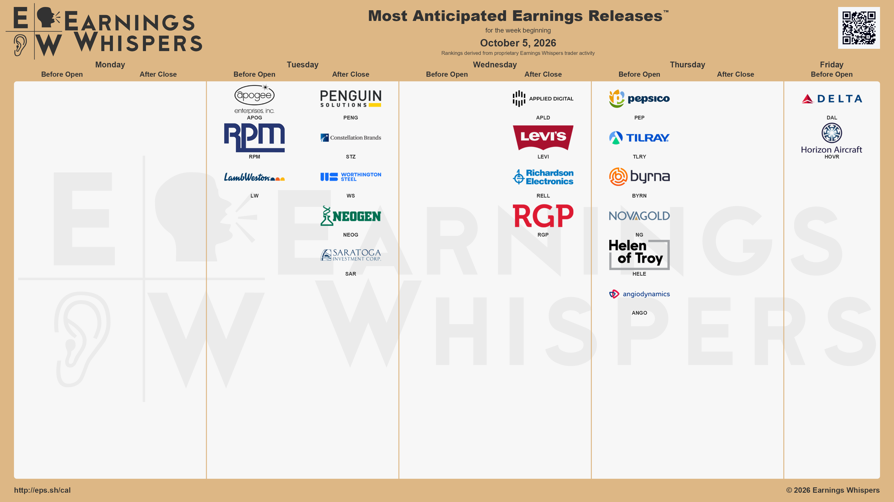
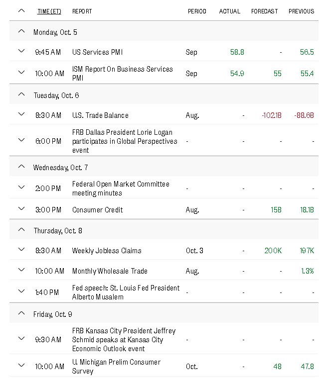

# Week 41 Discord preparation

The owner explicitly selected the supplied original external reference images
for distribution, accepting differences from verified website data. This is
selection of material, not authorization to send during this task.

The local attachment previews below use the original PNGs directly, without
altered text, WebP derivatives or a website screenshot:

- `Rapporter — Vecka 41, 2026` + `images/rapporter/week-41.png`
- `Makro — Vecka 41, 2026` + `images/makro/week-41.png`

Rapporter — Vecka 41, 2026



Makro — Vecka 41, 2026



The sender still emits only the caption and attachment, with no mentions, embeds,
links or extra message text. The existing adapter now reads the week-numbered
selection manifest instead of hard-coding Week 40. Exact kind, **full ISO year/week**,
path and SHA-256 must match, as must the independent canonical publication review.
The previous Week 40 selection remains unchanged. A changed image or mismatched
selection still fails closed; reference/canonical differences do not block these
explicitly selected originals.

Duplicate identities:

```text
earnings:2026-W41:0c1eb9dc8dc52932654fb6dd8377c86923aac282b9d3091c4376fcf63a4ab969
macro:2026-W41:040871f305df4fc27f1b19030457e95672dea6b931317bdbf228962336ab64de
```

Use `.github/workflows/discord-weekly.yml` (“Preview or distribute reviewed NTM
publications”). These are **all** workflow inputs; no extra confirmation input exists:

| Operation | `kind` | `week` | `send` |
| --- | --- | --- | --- |
| Earnings preview | `earnings` | `2026-W41` | `false` |
| Earnings live send | `earnings` | `2026-W41` | `true` |
| Macro preview | `macro` | `2026-W41` | `false` |
| Macro live send | `macro` | `2026-W41` | `true` |

Preview is a local/Actions JSON plan and attachment review, not a Discord post.
Live delivery later requires these changes to be available on `main`, a successful
preview job, `NTM_DISCORD_ENABLED=true`, the existing destination webhook secret
inside the protected **discord-distribution** environment, and owner environment
approval. Keep the existing `ntm-distribution-state` branch and `discord-ledger.json`;
do not reset history. Durable reservation, deduplication, concurrency and uncertain
delivery protections are unchanged. The workflow itself has no changes.

Local dry runs and mocked sends check both exact original byte streams, captions,
destinations and identities. They prove no-network previews, enable-switch rejection,
single delivery/deduplication and preservation of W39/W40 history. No remote ledger,
webhook, Actions run or environment configuration was accessed or modified.

Readiness: local preview/distribution preparation is ready; live runtime configuration
and owner approval have not been exercised. No messages were sent.
